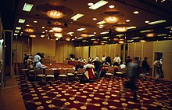
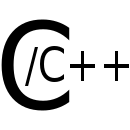

<p><strong>C++</strong>&nbsp;is a&nbsp;<a title="General-purpose programming language" href="https://en.wikipedia.org/wiki/General-purpose_programming_language">general-purpose programming language</a>&nbsp;created by&nbsp;<a title="Bjarne Stroustrup" href="https://en.wikipedia.org/wiki/Bjarne_Stroustrup">Bjarne Stroustrup</a>&nbsp;as an extension of the&nbsp;<a title="C (programming language)" href="https://en.wikipedia.org/wiki/C_(programming_language)">C programming language</a>, or "C with&nbsp;<a class="mw-redirect" title="Class (programming)" href="https://en.wikipedia.org/wiki/Class_(programming)">Classes</a>". The language has expanded significantly over time, and modern C++ has&nbsp;<a title="Object-oriented programming" href="https://en.wikipedia.org/wiki/Object-oriented_programming">object-oriented</a>,&nbsp;<a title="Generic programming" href="https://en.wikipedia.org/wiki/Generic_programming">generic</a>, and&nbsp;<a title="Functional programming" href="https://en.wikipedia.org/wiki/Functional_programming">functional</a>&nbsp;features in addition to facilities for&nbsp;<a title="Low-level programming language" href="https://en.wikipedia.org/wiki/Low-level_programming_language">low-level</a>&nbsp;<a class="mw-redirect" title="Memory (computing)" href="https://en.wikipedia.org/wiki/Memory_(computing)">memory</a>&nbsp;manipulation. It is almost always implemented as a&nbsp;<a title="Compiled language" href="https://en.wikipedia.org/wiki/Compiled_language">compiled language</a>, and many vendors provide&nbsp;<a title="List of compilers" href="https://en.wikipedia.org/wiki/List_of_compilers#C.2B.2B_compilers">C++ compilers</a>, including the&nbsp;<a title="Free Software Foundation" href="https://en.wikipedia.org/wiki/Free_Software_Foundation">Free Software Foundation</a>,&nbsp;<a title="LLVM" href="https://en.wikipedia.org/wiki/LLVM">LLVM</a>,&nbsp;<a title="Microsoft" href="https://en.wikipedia.org/wiki/Microsoft">Microsoft</a>,&nbsp;<a title="Intel" href="https://en.wikipedia.org/wiki/Intel">Intel</a>,&nbsp;<a title="Oracle Developer Studio" href="https://en.wikipedia.org/wiki/Oracle_Developer_Studio">Oracle</a>, and&nbsp;<a title="IBM" href="https://en.wikipedia.org/wiki/IBM">IBM</a>, so it is available on many platforms.</p>
<p>C++ was designed with a bias toward&nbsp;<a class="mw-redirect" title="System programming" href="https://en.wikipedia.org/wiki/System_programming">system programming</a>&nbsp;and&nbsp;<a title="Embedded software" href="https://en.wikipedia.org/wiki/Embedded_software">embedded</a>, resource-constrained software and large systems, with&nbsp;<a class="mw-redirect" title="Performance (software)" href="https://en.wikipedia.org/wiki/Performance_(software)">performance</a>, efficiency, and flexibility of use as its design highlights.&nbsp;C++ has also been found useful in many other contexts, with key strengths being software infrastructure and resource-constrained applications,&nbsp;including&nbsp;<a title="Application software" href="https://en.wikipedia.org/wiki/Application_software">desktop applications</a>,&nbsp;<a title="Server (computing)" href="https://en.wikipedia.org/wiki/Server_(computing)">servers</a>&nbsp;(e.g.&nbsp;<a title="E-commerce" href="https://en.wikipedia.org/wiki/E-commerce">e-commerce</a>,&nbsp;<a title="Web search engine" href="https://en.wikipedia.org/wiki/Web_search_engine">Web search</a>, or&nbsp;<a title="SQL" href="https://en.wikipedia.org/wiki/SQL">SQL</a>&nbsp;servers), and performance-critical applications (e.g.&nbsp;<a class="mw-redirect" title="Telephone switches" href="https://en.wikipedia.org/wiki/Telephone_switches">telephone switches</a>&nbsp;or&nbsp;<a class="mw-redirect" title="Space probes" href="https://en.wikipedia.org/wiki/Space_probes">space probes</a>).</p>
<p>C++ is standardized by the&nbsp;<a title="International Organization for Standardization" href="https://en.wikipedia.org/wiki/International_Organization_for_Standardization">International Organization for Standardization</a>&nbsp;(ISO), with the latest standard version ratified and published by ISO in December 2017 as&nbsp;<a href="https://en.wikipedia.org/wiki/C%2B%2B#Standardization"><em>ISO/IEC 14882:2017</em></a>&nbsp;(informally known as&nbsp;<a title="C++17" href="https://en.wikipedia.org/wiki/C%2B%2B17">C++17</a>).&nbsp;The C++ programming language was initially standardized in 1998 as&nbsp;<em>ISO/IEC 14882:1998</em>, which was then amended by the&nbsp;<a title="C++03" href="https://en.wikipedia.org/wiki/C%2B%2B03">C++03</a>,&nbsp;<a title="C++11" href="https://en.wikipedia.org/wiki/C%2B%2B11">C++11</a>&nbsp;and&nbsp;<a title="C++14" href="https://en.wikipedia.org/wiki/C%2B%2B14">C++14</a>&nbsp;standards. The current C++17 standard supersedes these with new features and an enlarged&nbsp;<a href="https://en.wikipedia.org/wiki/C%2B%2B#Standard_library">standard library</a>. Before the initial standardization in 1998, C++ was developed by Danish computer scientist&nbsp;<a title="Bjarne Stroustrup" href="https://en.wikipedia.org/wiki/Bjarne_Stroustrup">Bjarne Stroustrup</a>&nbsp;at&nbsp;<a title="Bell Labs" href="https://en.wikipedia.org/wiki/Bell_Labs">Bell Labs</a>&nbsp;since 1979 as an extension of the&nbsp;<a title="C (programming language)" href="https://en.wikipedia.org/wiki/C_(programming_language)">C language</a>; he wanted an efficient and flexible language similar to C that also provided&nbsp;<a title="High-level programming language" href="https://en.wikipedia.org/wiki/High-level_programming_language">high-level features</a>&nbsp;for program organization.&nbsp;<a title="C++20" href="https://en.wikipedia.org/wiki/C%2B%2B20">C++20</a>&nbsp;is the next planned standard, keeping with the current trend of a new version every three years.</p>
</br>
<table class="infobox vevent">
<tbody>
<tr>
<td colspan="2"><a class="image" href="C++_Logo.png"></a>
<div>&nbsp;</div>
</td>
</tr>
<tr>
<th scope="row"><a title="Programming paradigm" href="https://en.wikipedia.org/wiki/Programming_paradigm">Paradigms</a></th>
<td><a class="mw-redirect" title="Multi-paradigm programming language" href="https://en.wikipedia.org/wiki/Multi-paradigm_programming_language">Multi-paradigm</a>:&nbsp;<a title="Procedural programming" href="https://en.wikipedia.org/wiki/Procedural_programming">procedural</a>,&nbsp;<a title="Functional programming" href="https://en.wikipedia.org/wiki/Functional_programming">functional</a>,&nbsp;<a title="Object-oriented programming" href="https://en.wikipedia.org/wiki/Object-oriented_programming">object-oriented</a>,&nbsp;<a title="Generic programming" href="https://en.wikipedia.org/wiki/Generic_programming">generic</a></td>
</tr>
<tr>
<th scope="row">Family</th>
<td><a title="C (programming language)" href="https://en.wikipedia.org/wiki/C_(programming_language)">C</a></td>
</tr>
<tr>
<th scope="row"><a title="Software design" href="https://en.wikipedia.org/wiki/Software_design">Designed&nbsp;by</a></th>
<td><a title="Bjarne Stroustrup" href="https://en.wikipedia.org/wiki/Bjarne_Stroustrup">Bjarne Stroustrup</a></td>
</tr>
<tr>
<th scope="row"><a class="mw-redirect" title="Software developer" href="https://en.wikipedia.org/wiki/Software_developer">Developer</a></th>
<td class="organiser">ISO/IEC JTC1 (Joint Technical Committee 1) / SC22 (Subcommittee 22) / WG21 (Working Group 21)</td>
</tr>
<tr>
<th scope="row">First&nbsp;appeared</th>
<td>1985<span class="noprint">; 35&nbsp;years ago</span></td>
</tr>
<tr>
<td colspan="2">&nbsp;</td>
</tr>
<tr>
<th scope="row"><a title="Software release life cycle" href="https://en.wikipedia.org/wiki/Software_release_life_cycle">Stable release</a></th>
<td>
<div>C++17&nbsp;(ISO/IEC 14882:2017)&nbsp;/ 1&nbsp;December 2017<span class="noprint">; 2 years ago</span></div>
</td>
</tr>
<tr>
<th scope="row"><a title="Software release life cycle" href="https://en.wikipedia.org/wiki/Software_release_life_cycle">Preview release</a></th>
<td>
<div>C++20</div>
</td>
</tr>
<tr>
<th scope="row"><a title="Type system" href="https://en.wikipedia.org/wiki/Type_system">Typing discipline</a></th>
<td><a class="mw-redirect" title="Static type" href="https://en.wikipedia.org/wiki/Static_type">Static</a>,&nbsp;<a title="Nominal type system" href="https://en.wikipedia.org/wiki/Nominal_type_system">nominative</a>,&nbsp;<a title="Type inference" href="https://en.wikipedia.org/wiki/Type_inference">partially inferred</a></td>
</tr>
<tr>
<th scope="row"><a title="Filename extension" href="https://en.wikipedia.org/wiki/Filename_extension">Filename extensions</a></th>
<td>.C, .cc, .cpp, .cxx,&nbsp;<span class="nowrap">.c++</span>, .h, .hh, .hpp, .hxx,&nbsp;<span class="nowrap">.h++</span></td>
</tr>
<tr>
<th scope="row">Website</th>
<td><span class="url"><a class="external text" href="https://isocpp.org/" rel="nofollow">isocpp<wbr />.org</a></span></td>
</tr>
<tr>
<th colspan="2">Major&nbsp;<a title="Programming language implementation" href="https://en.wikipedia.org/wiki/Programming_language_implementation">implementations</a></th>
</tr>
<tr>
<td colspan="2"><span class="nowraplinks"><a title="Clang" href="https://en.wikipedia.org/wiki/Clang">LLVM Clang</a>,&nbsp;<a title="GNU Compiler Collection" href="https://en.wikipedia.org/wiki/GNU_Compiler_Collection">GCC</a>,&nbsp;<a title="Microsoft Visual C++" href="https://en.wikipedia.org/wiki/Microsoft_Visual_C%2B%2B">Microsoft Visual C++</a>,&nbsp;<a title="C++Builder" href="https://en.wikipedia.org/wiki/C%2B%2BBuilder">Embarcadero C++Builder</a>,&nbsp;<a title="Intel C++ Compiler" href="https://en.wikipedia.org/wiki/Intel_C%2B%2B_Compiler">Intel C++ Compiler</a>,&nbsp;<a class="mw-redirect" title="IBM XL C++" href="https://en.wikipedia.org/wiki/IBM_XL_C%2B%2B">IBM XL C++</a>,&nbsp;<a title="Edison Design Group" href="https://en.wikipedia.org/wiki/Edison_Design_Group">EDG</a></span></td>
</tr>
<tr>
<th colspan="2">Influenced by</th>
</tr>
<tr>
<td colspan="2"><a title="Ada (programming language)" href="https://en.wikipedia.org/wiki/Ada_(programming_language)">Ada</a>,&nbsp;<a title="ALGOL 68" href="https://en.wikipedia.org/wiki/ALGOL_68">ALGOL 68</a>,&nbsp;<a title="C (programming language)" href="https://en.wikipedia.org/wiki/C_(programming_language)">C</a>,&nbsp;<a title="CLU (programming language)" href="https://en.wikipedia.org/wiki/CLU_(programming_language)">CLU</a>,&nbsp;<a title="ML (programming language)" href="https://en.wikipedia.org/wiki/ML_(programming_language)">ML</a>,&nbsp;<a title="Simula" href="https://en.wikipedia.org/wiki/Simula">Simula</a></td>
</tr>
<tr>
<th colspan="2">Influenced</th>
</tr>
<tr>
<td colspan="2"><a title="Ada (programming language)" href="https://en.wikipedia.org/wiki/Ada_(programming_language)">Ada 95</a>,&nbsp;<a title="C Sharp (programming language)" href="https://en.wikipedia.org/wiki/C_Sharp_(programming_language)">C#</a>,&nbsp;<a title="C99" href="https://en.wikipedia.org/wiki/C99">C99</a>,&nbsp;<a title="Chapel (programming language)" href="https://en.wikipedia.org/wiki/Chapel_(programming_language)">Chapel</a>,&nbsp;<a title="Clojure" href="https://en.wikipedia.org/wiki/Clojure">Clojure</a>,&nbsp;<a title="D (programming language)" href="https://en.wikipedia.org/wiki/D_(programming_language)">D</a>,&nbsp;<a title="Java (programming language)" href="https://en.wikipedia.org/wiki/Java_(programming_language)">Java</a>,&nbsp;<a title="Lua (programming language)" href="https://en.wikipedia.org/wiki/Lua_(programming_language)">Lua</a>,&nbsp;<a title="Nim (programming language)" href="https://en.wikipedia.org/wiki/Nim_(programming_language)">Nim</a>,&nbsp;<a title="Perl" href="https://en.wikipedia.org/wiki/Perl">Perl</a>,&nbsp;<a title="PHP" href="https://en.wikipedia.org/wiki/PHP">PHP</a>,&nbsp;<a title="Python (programming language)" href="https://en.wikipedia.org/wiki/Python_(programming_language)">Python</a>,&nbsp;<a title="Rust (programming language)" href="https://en.wikipedia.org/wiki/Rust_(programming_language)">Rust</a>,&nbsp;<a title="Seed7" href="https://en.wikipedia.org/wiki/Seed7">Seed7</a></td>
</tr>
<tr>
<td class="hlist" colspan="2">
<p><a class="image" href="logo.png"></a>&nbsp;<a class="extiw" title="wikibooks:C++ Programming" href="https://en.wikibooks.org/wiki/C%2B%2B_Programming">C++ Programming</a>&nbsp;at Wikibooks</p>
</td>
</tr>
</tbody>
</table>

</br>


<div class="toctitle" dir="ltr" lang="en"></div>
<h2>Contents</h2>
<label class="toctogglelabel" for="toctogglecheckbox"></label></div>
<ul>
<li class="toclevel-1 tocsection-1"><a href="#History"><span class="toctext">History</span></a>
<ul>
<li class="toclevel-2 tocsection-2"><a href="#Etymology"><span class="toctext">Etymology</span></a></li>
<li class="toclevel-2 tocsection-3"><a href="#Philosophy"><span class="toctext">Philosophy</span></a></li>
<li class="toclevel-2 tocsection-4"><a href="#Standardization"><span class="toctext">Standardization</span></a></li>
</ul>
</li>
<li class="toclevel-1 tocsection-5"><a href="#Language"><span class="toctext">Language</span></a>
<ul>
<li class="toclevel-2 tocsection-6"><a href="#Object_storage"><span class="toctext">Object storage</span></a>
<ul>
<li class="toclevel-3 tocsection-7"><a href="#Static_storage_duration_objects"><span class="toctext">Static storage duration objects</span></a></li>
<li class="toclevel-3 tocsection-8"><a href="#Thread_storage_duration_objects"><span class="toctext">Thread storage duration objects</span></a></li>
<li class="toclevel-3 tocsection-9"><a href="#Automatic_storage_duration_objects"><span class="toctext">Automatic storage duration objects</span></a></li>
<li class="toclevel-3 tocsection-10"><a href="#Dynamic_storage_duration_objects"><span class="toctext">Dynamic storage duration objects</span></a></li>
</ul>
</li>
<li class="toclevel-2 tocsection-11"><a href="#Templates"><span class="toctext">Templates</span></a></li>
<li class="toclevel-2 tocsection-12"><a href="#Objects"><span class="toctext">Objects</span></a>
<ul>
<li class="toclevel-3 tocsection-13"><a href="#Encapsulation"><span class="toctext">Encapsulation</span></a></li>
<li class="toclevel-3 tocsection-14"><a href="#Inheritance"><span class="toctext">Inheritance</span></a></li>
</ul>
</li>
<li class="toclevel-2 tocsection-15"><a href="#Operators_and_operator_overloading"><span class="toctext">Operators and operator overloading</span></a></li>
<li class="toclevel-2 tocsection-16"><a href="#Polymorphism"><span class="toctext">Polymorphism</span></a>
<ul>
<li class="toclevel-3 tocsection-17"><a href="#Static_polymorphism"><span class="toctext">Static polymorphism</span></a></li>
<li class="toclevel-3 tocsection-18"><a href="#Dynamic_polymorphism"><span class="toctext">Dynamic polymorphism</span></a>
<ul>
<li class="toclevel-4 tocsection-19"><a href="#Inheritance_2"><span class="toctext">Inheritance</span></a></li>
<li class="toclevel-4 tocsection-20"><a href="#Virtual_member_functions"><span class="toctext">Virtual member functions</span></a></li>
</ul>
</li>
</ul>
</li>
<li class="toclevel-2 tocsection-21"><a href="#Lambda_expressions"><span class="toctext">Lambda expressions</span></a></li>
<li class="toclevel-2 tocsection-22"><a href="#Exception_handling"><span class="toctext">Exception handling</span></a></li>
</ul>
</li>
<li class="toclevel-1 tocsection-23"><a href="#Standard_library"><span class="toctext">Standard library</span></a></li>
<li class="toclevel-1 tocsection-24"><a href="#Compatibility"><span class="toctext">Compatibility</span></a>
<ul>
<li class="toclevel-2 tocsection-25"><a href="#With_C"><span class="toctext">With C</span></a></li>
</ul>
</li>
<li class="toclevel-1 tocsection-26"><a href="#Criticism"><span class="toctext">Criticism</span></a></li>
 <li class="toclevel-1 tocsection-26"><a href="#C++ Exercises for Beginners"><span class="toctext">C++ Exercises for Beginners</span></a></li> 
</ul>
</br>

<h2><span id="History" class="mw-headline">History</span></h2>
<p>&nbsp;</p>
<div class="thumb tright">
<div class="thumbinner"><a class="image" href="bk.jpg"></a>
<div class="thumbcaption">
<div class="magnify">&nbsp;</div>
<strong>Bjarne Stroustrup, the creator of C++, in his AT&amp;T New Jersey office c. 2000</strong></div>
<div class="thumbcaption">&nbsp;</div>
</div>
</div>


</br>
<h2>Publications </h2>
<ul>
 <li><a target="_blank" href="https://github.com/manjunath5496/C-Plus-Plus-Tutorial/blob/master/cg(1).pdf" style="text-decoration:none;">Abstraction, libraries, and efficiency in C++</a></li>
                            
 <li><a target="_blank" href="https://github.com/manjunath5496/C-Plus-Plus-Tutorial/blob/master/cg(2).pdf" style="text-decoration:none;">Abstraction and the C++ machine model</a></li>

<li><a target="_blank" href="https://github.com/manjunath5496/C-Plus-Plus-Tutorial/blob/master/cg(3).pdf" style="text-decoration:none;">A Brief Look at C++</a></li>
 <li><a target="_blank" href="https://github.com/manjunath5496/C-Plus-Plus-Tutorial/blob/master/cg(4).pdf" style="text-decoration:none;">Programming and Validation Techniques for Reliable Goal-driven Autonomic Software</a></li>                              
<li><a target="_blank" href="https://github.com/manjunath5496/C-Plus-Plus-Tutorial/blob/master/cg(5).pdf" style="text-decoration:none;">Verification and Semantic Parallelization of Goal-driven Autonomous Software</a></li>
<li><a target="_blank" href="https://github.com/manjunath5496/C-Plus-Plus-Tutorial/blob/master/cg(6).pdf" style="text-decoration:none;">C and C++: a Case for Compatibility</a></li>
 <li><a target="_blank" href="https://github.com/manjunath5496/C-Plus-Plus-Tutorial/blob/master/cg(7).pdf" style="text-decoration:none;">An Overview of the C++ Programming Language</a></li>                              
<li><a target="_blank" href="https://github.com/manjunath5496/C-Plus-Plus-Tutorial/blob/master/cg(8).pdf" style="text-decoration:none;">C++ in 2005 </a></li>

<li><a target="_blank" href="https://github.com/manjunath5496/C-Plus-Plus-Tutorial/blob/master/cg(9).pdf" style="text-decoration:none;"> Charles Stark Draper Prize acceptance speech</a></li>
 <li><a target="_blank" href="https://github.com/manjunath5496/C-Plus-Plus-Tutorial/blob/master/cg(10).pdf" style="text-decoration:none;">Programming with Exceptions</a></li>                              
<li><a target="_blank" href="https://github.com/manjunath5496/C-Plus-Plus-Tutorial/blob/master/cg(11).pdf" style="text-decoration:none;">Foundations of C++</a></li>


<li><a target="_blank" href="https://github.com/manjunath5496/C-Plus-Plus-Tutorial/blob/master/cg(12).pdf" style="text-decoration:none;">C and C++: Case Studies in Compatibility</a></li>
 <li><a target="_blank" href="https://github.com/manjunath5496/C-Plus-Plus-Tutorial/blob/master/cg(13).pdf" style="text-decoration:none;">Exception Safety: Concepts and Techniques</a></li>                              
<li><a target="_blank" href="https://github.com/manjunath5496/C-Plus-Plus-Tutorial/blob/master/cg(14).pdf" style="text-decoration:none;">Exception Handling for C++ </a></li>


<li><a target="_blank" href="https://github.com/manjunath5496/C-Plus-Plus-Tutorial/blob/master/cg(15).pdf" style="text-decoration:none;">Fast dynamic casting</a></li>
 <li><a target="_blank" href="https://github.com/manjunath5496/C-Plus-Plus-Tutorial/blob/master/cg(16).pdf" style="text-decoration:none;">Practical and Verifiable C++ Dynamic Cast for Hard Real-Time Systems</a></li>                              
<li><a target="_blank" href="https://github.com/manjunath5496/C-Plus-Plus-Tutorial/blob/master/cg(17).pdf" style="text-decoration:none;">A Principled, Complete, and Efficient Representation of C++</a></li>


<li><a target="_blank" href="https://github.com/manjunath5496/C-Plus-Plus-Tutorial/blob/master/cg(18).pdf" style="text-decoration:none;">Concepts: The Future of Generic Programming</a></li>
 <li><a target="_blank" href="https://github.com/manjunath5496/C-Plus-Plus-Tutorial/blob/master/cg(19).pdf" style="text-decoration:none;">Evolving a language in and for the real world: C++ 1991-2006</a></li>                              
<li><a target="_blank" href="https://github.com/manjunath5496/C-Plus-Plus-Tutorial/blob/master/cg(20).pdf" style="text-decoration:none;">How to Write a C++ Language Extension Proposal for ANSI-X3J16/ISO-WG21 </a></li>

<li><a target="_blank" href="https://github.com/manjunath5496/C-Plus-Plus-Tutorial/blob/master/cg(21).pdf" style="text-decoration:none;">Improving performance and maintainability through refactoring in C++11 </a></li>

<li><a target="_blank" href="https://github.com/manjunath5496/C-Plus-Plus-Tutorial/blob/master/cg(22).pdf" style="text-decoration:none;">C++ Dynamic Cast in Autonomous Space Systems</a></li>

 <li><a target="_blank" href="https://github.com/manjunath5496/C-Plus-Plus-Tutorial/blob/master/cg(23).pdf" style="text-decoration:none;">Understanding and Effectively Preventing the ABA Problem in Descriptor-based Lock-free Designs</a></li>                              
<li><a target="_blank" href="https://github.com/manjunath5496/C-Plus-Plus-Tutorial/blob/master/cg(24).pdf" style="text-decoration:none;">Lock-free Dynamically Resizable Arrays </a></li>

<li><a target="_blank" href="https://github.com/manjunath5496/C-Plus-Plus-Tutorial/blob/master/cg(25).pdf" style="text-decoration:none;">A Principled, Complete, and Efficient Representation of C++ </a></li>

<li><a target="_blank" href="https://github.com/manjunath5496/C-Plus-Plus-Tutorial/blob/master/cg(26).pdf" style="text- decoration:none;">Model-based Product-Oriented Certification</a></li>
<li><a target="_blank" href="https://github.com/manjunath5496/C-Plus-Plus-Tutorial/blob/master/cg(27).pdf" style="text-decoration:none;">Open Multi-Methods for C++</a></li>


<li><a target="_blank" href="https://github.com/manjunath5496/C-Plus-Plus-Tutorial/blob/master/cg(28).pdf" style="text-decoration:none;">Five Popular Myths about C++</a></li>

<li><a target="_blank" href="https://github.com/manjunath5496/C-Plus-Plus-Tutorial/blob/master/cg(29).pdf" style="text-decoration:none;">Learning Standard C++ as a New Language</a></li>

<li><a target="_blank" href="https://github.com/manjunath5496/C-Plus-Plus-Tutorial/blob/master/cg(30).pdf" style="text-decoration:none;">Design and evaluation of C++ open multi-methods</a></li>

 <li><a target="_blank" href="https://github.com/manjunath5496/C-Plus-Plus-Tutorial/blob/master/cg(31).pdf" style="text-decoration:none;">Runtime Concepts for the C++ Standard Template Library</a></li>                              
<li><a target="_blank" href="https://github.com/manjunath5496/C-Plus-Plus-Tutorial/blob/master/cg(32).pdf" style="text-decoration:none;">Why C++ is not just an Object Oriented Programming Language </a></li>

<li><a target="_blank" href="https://github.com/manjunath5496/C-Plus-Plus-Tutorial/blob/master/cg(33).pdf" style="text-decoration:none;">Concepts: Linguistic Support for Generic Programming in C++ </a></li>

<li><a target="_blank" href="https://github.com/manjunath5496/C-Plus-Plus-Tutorial/blob/master/cg(34).pdf" style="text- decoration:none;">Scalable Nonblocking Concurrent Objects for Mission Critical Code</a></li>
<li><a target="_blank" href="https://github.com/manjunath5496/C-Plus-Plus-Tutorial/blob/master/cg(35).pdf" style="text-decoration:none;">Open and Efficient Type Switch for C++</a></li>

<li><a target="_blank" href="https://github.com/manjunath5496/C-Plus-Plus-Tutorial/blob/master/cg(36).pdf" style="text-decoration:none;">Open Pattern Matching for C++ </a></li>

<li><a target="_blank" href="https://github.com/manjunath5496/C-Plus-Plus-Tutorial/blob/master/cg(37).pdf" style="text- decoration:none;">Using ownership types to support library aliasing boundaries</a></li>
<li><a target="_blank" href="https://github.com/manjunath5496/C-Plus-Plus-Tutorial/blob/master/cg(38).pdf" style="text-decoration:none;">Specifying C++ Concepts</a></li>

<li><a target="_blank" href="https://github.com/manjunath5496/C-Plus-Plus-Tutorial/blob/master/cg(39).pdf" style="text-decoration:none;">A brief introduction to C++'s model for type- and resource-safety</a></li>

<li><a target="_blank" href="https://github.com/manjunath5496/C-Plus-Plus-Tutorial/blob/master/cg(40).pdf" style="text-decoration:none;">The Design of C++0x</a></li>


 <li><a target="_blank" href="https://github.com/manjunath5496/C-Plus-Plus-Tutorial/blob/master/cg(41).pdf" style="text-decoration:none;">General Constant Expressions for System Programming Languages</a></li>                              
<li><a target="_blank" href="https://github.com/manjunath5496/C-Plus-Plus-Tutorial/blob/master/cg(42).pdf" style="text-decoration:none;">Minimizing Dependencies within Generic Classes for Faster and Smaller Programs </a></li>

<li><a target="_blank" href="https://github.com/manjunath5496/C-Plus-Plus-Tutorial/blob/master/cg(43).pdf" style="text-decoration:none;">Semantically Enhanced Containers for Concurrent Real-Time Systems</a></li>

<li><a target="_blank" href="https://github.com/manjunath5496/C-Plus-Plus-Tutorial/blob/master/cg(44).pdf" style="text- decoration:none;">Supporting SELL for High-Performance Computing</a></li>
<li><a target="_blank" href="https://github.com/manjunath5496/C-Plus-Plus-Tutorial/blob/master/cg(45).pdf" style="text-decoration:none;">A rationale for semantically enhanced library languages</a></li>

<li><a target="_blank" href="https://github.com/manjunath5496/C-Plus-Plus-Tutorial/blob/master/cg(46).pdf" style="text-decoration:none;">Sibling Rivalry: C and C++ </a></li>

<li><a target="_blank" href="https://github.com/manjunath5496/C-Plus-Plus-Tutorial/blob/master/cg(47).pdf" style="text- decoration:none;">C and C++: Siblings</a></li>
<li><a target="_blank" href="https://github.com/manjunath5496/C-Plus-Plus-Tutorial/blob/master/cg(48).pdf" style="text-decoration:none;">Support for the Evolution of C++ Generic Functions</a></li>

<li><a target="_blank" href="https://github.com/manjunath5496/C-Plus-Plus-Tutorial/blob/master/cg(49).pdf" style="text-decoration:none;">Design of Concept Libraries for C++</a></li>

<li><a target="_blank" href="https://github.com/manjunath5496/C-Plus-Plus-Tutorial/blob/master/cg(50).pdf" style="text-decoration:none;">Reliable and Efficient Concurrent Synchronization for Embedded Real-Time Software</a></li>

 <li><a target="_blank" href="https://github.com/manjunath5496/C-Plus-Plus-Tutorial/blob/master/cg(51).pdf" style="text-decoration:none;">Source Code Rejuvenation is not Refactoring</a></li>                              
<li><a target="_blank" href="https://github.com/manjunath5496/C-Plus-Plus-Tutorial/blob/master/cg(52).pdf" style="text-decoration:none;">Programming in an undergraduate CS curriculum </a></li>

<li><a target="_blank" href="https://github.com/manjunath5496/C-Plus-Plus-Tutorial/blob/master/cg(53).pdf" style="text-decoration:none;">Software Development for Infrastructure</a></li>

<li><a target="_blank" href="https://github.com/manjunath5496/C-Plus-Plus-Tutorial/blob/master/cg(54).pdf" style="text- decoration:none;">Sixteen Ways to Stack a Cat</a></li>
<li><a target="_blank" href="https://github.com/manjunath5496/C-Plus-Plus-Tutorial/blob/master/cg(55).pdf" style="text-decoration:none;">FOREWORD: Serving the C++ Community</a></li>

<li><a target="_blank" href="https://github.com/manjunath5496/C-Plus-Plus-Tutorial/blob/master/cg(56).pdf" style="text-decoration:none;">A Perspective on ISO C++</a></li>

<li><a target="_blank" href="https://github.com/manjunath5496/C-Plus-Plus-Tutorial/blob/master/cg(57).pdf" style="text- decoration:none;">C++ Programming Styles and Libraries</a></li>
<li><a target="_blank" href="https://github.com/manjunath5496/C-Plus-Plus-Tutorial/blob/master/cg(58).pdf" style="text-decoration:none;">Electronic Appendix for Untangling the Balancing and Searching of Balanced Binary Search Trees</a></li>

<li><a target="_blank" href="https://github.com/manjunath5496/C-Plus-Plus-Tutorial/blob/master/cg(59).pdf" style="text-decoration:none;">What is "Object Oriented Programming"? (1991 revised version)</a></li>

<li><a target="_blank" href="https://github.com/manjunath5496/C-Plus-Plus-Tutorial/blob/master/cg(60).pdf" style="text-decoration:none;">What is C++0x?</a></li>

<li><a target="_blank" href="https://github.com/manjunath5496/C-Plus-Plus-Tutorial/blob/master/cg(61).pdf" style="text-decoration:none;">Generalizing Overloading for C++2000</a></li>

<li><a target="_blank" href="https://github.com/manjunath5496/C-Plus-Plus-Tutorial/blob/master/cg(62).pdf" style="text-decoration:none;">Wrapping C++ Member Function Calls</a></li>

<li><a target="_blank" href="https://github.com/manjunath5496/C-Plus-Plus-Tutorial/blob/master/cg(63).pdf" style="text-decoration:none;">What Should We Teach New Software Developers? Why?</a></li>
</ul>
</br>


<p>In 1979,&nbsp;<a title="Bjarne Stroustrup" href="https://en.wikipedia.org/wiki/Bjarne_Stroustrup">Bjarne Stroustrup</a>, a Danish&nbsp;<a title="Computer scientist" href="https://en.wikipedia.org/wiki/Computer_scientist">computer scientist</a>, began work on "<span id="C_with_[[Class_(computer_programming)|Classes]]">C with&nbsp;<a title="Class (computer programming)" href="https://en.wikipedia.org/wiki/Class_(computer_programming)">Classes</a></span>", the predecessor to C++.&nbsp;The motivation for creating a new language originated from Stroustrup's experience in programming for his PhD thesis. Stroustrup found that&nbsp;<a title="Simula" href="https://en.wikipedia.org/wiki/Simula">Simula</a>&nbsp;had features that were very helpful for large software development, but the language was too slow for practical use, while&nbsp;<a title="BCPL" href="https://en.wikipedia.org/wiki/BCPL">BCPL</a>&nbsp;was fast but too low-level to be suitable for large software development. When Stroustrup started working in&nbsp;<a class="mw-redirect" title="AT&amp;T Bell Labs" href="https://en.wikipedia.org/wiki/AT%26T_Bell_Labs">AT&amp;T Bell Labs</a>, he had the problem of analyzing the&nbsp;<a title="Unix" href="https://en.wikipedia.org/wiki/Unix">UNIX</a>&nbsp;<a class="mw-redirect" title="Kernel (computer science)" href="https://en.wikipedia.org/wiki/Kernel_(computer_science)">kernel</a>&nbsp;with respect to&nbsp;<a title="Distributed computing" href="https://en.wikipedia.org/wiki/Distributed_computing">distributed computing</a>. Remembering his Ph.D. experience, Stroustrup set out to enhance the&nbsp;<a title="C (programming language)" href="https://en.wikipedia.org/wiki/C_(programming_language)">C</a>&nbsp;language with&nbsp;<a title="Simula" href="https://en.wikipedia.org/wiki/Simula">Simula</a>-like features.&nbsp;C was chosen because it was general-purpose, fast, portable and widely used. As well as C and Simula's influences, other languages also influenced this new language, including&nbsp;<a title="ALGOL 68" href="https://en.wikipedia.org/wiki/ALGOL_68">ALGOL 68</a>,&nbsp;<a title="Ada (programming language)" href="https://en.wikipedia.org/wiki/Ada_(programming_language)">Ada</a>,&nbsp;<a title="CLU (programming language)" href="https://en.wikipedia.org/wiki/CLU_(programming_language)">CLU</a>&nbsp;and&nbsp;<a title="ML (programming language)" href="https://en.wikipedia.org/wiki/ML_(programming_language)">ML</a>.</p>
<p>Initially, Stroustrup's "C with Classes" added features to the C compiler, Cpre, including&nbsp;<a title="Class (computer programming)" href="https://en.wikipedia.org/wiki/Class_(computer_programming)">classes</a>,&nbsp;<a class="mw-redirect" title="Derived class" href="https://en.wikipedia.org/wiki/Derived_class">derived classes</a>,&nbsp;<a class="mw-redirect" title="Strong typing" href="https://en.wikipedia.org/wiki/Strong_typing">strong typing</a>,&nbsp;<a class="mw-redirect" title="Inlining" href="https://en.wikipedia.org/wiki/Inlining">inlining</a>&nbsp;and&nbsp;<a title="Default argument" href="https://en.wikipedia.org/wiki/Default_argument">default arguments</a>.</p>
<p>In 1982, Stroustrup started to develop a successor to C with Classes, which he named "C++" (<code class="mw-highlight" dir="ltr"><span class="o">++</span></code>&nbsp;being the&nbsp;<a class="mw-redirect" title="Increment operator" href="https://en.wikipedia.org/wiki/Increment_operator">increment operator</a>&nbsp;in C) after going through several other names. New features were added, including&nbsp;<a title="Virtual function" href="https://en.wikipedia.org/wiki/Virtual_function">virtual functions</a>, function name and&nbsp;<a title="Operator overloading" href="https://en.wikipedia.org/wiki/Operator_overloading">operator overloading</a>, references, constants, type-safe free-store memory allocation (new/delete), improved type checking, and BCPL style single-line comments with two forward slashes (<code class="mw-highlight" dir="ltr"><span class="c1">//</span></code>). Furthermore, Stroustrup developed a new, standalone compiler for C++,&nbsp;<a title="Cfront" href="https://en.wikipedia.org/wiki/Cfront">Cfront</a>.</p>
<p>In 1985, the first edition of&nbsp;<em><a title="The C++ Programming Language" href="https://en.wikipedia.org/wiki/The_C%2B%2B_Programming_Language">The C++ Programming Language</a></em>&nbsp;was released, which became the definitive reference for the language, as there was not yet an official standard.&nbsp;The first commercial implementation of C++ was released in October of the same year.</p>
<p>In 1989, C++ 2.0 was released, followed by the updated second edition of&nbsp;<em>The C++ Programming Language</em>&nbsp;in 1991.&nbsp;New features in 2.0 included multiple inheritance, abstract classes, static member functions,&nbsp;<a class="mw-redirect" title="Const correctness" href="https://en.wikipedia.org/wiki/Const_correctness">const member functions</a>, and protected members. In 1990,&nbsp;<em>The Annotated C++ Reference Manual</em>&nbsp;was published. This work became the basis for the future standard. Later feature additions included&nbsp;<a class="mw-redirect" title="Template (programming)" href="https://en.wikipedia.org/wiki/Template_(programming)">templates</a>,&nbsp;<a title="Exception handling" href="https://en.wikipedia.org/wiki/Exception_handling">exceptions</a>,&nbsp;<a class="mw-redirect" title="Namespaces" href="https://en.wikipedia.org/wiki/Namespaces">namespaces</a>, new&nbsp;<a class="mw-redirect" title="Cast (computer science)" href="https://en.wikipedia.org/wiki/Cast_(computer_science)">casts</a>, and a&nbsp;<a class="mw-redirect" title="Boolean datatype" href="https://en.wikipedia.org/wiki/Boolean_datatype">boolean type</a>.</p>
<p>&nbsp;</p>
<div class="thumb tleft">
<div class="thumbinner"><a class="image" href="bh.jpg"></a>
<div class="thumbcaption">
<div class="magnify"><strong>&nbsp;</strong></div>
<strong>A quiz on C++11 features being given in Paris in 2015</strong></div>
<div class="thumbcaption">&nbsp;</div>
</div>
</div>
<p>In 1998, C++98 was released, standardizing the language, and a minor update (<a title="C++03" href="https://en.wikipedia.org/wiki/C%2B%2B03">C++03</a>) was released in 2003.</p>
<p>After C++98, C++ evolved relatively slowly until, in 2011, the&nbsp;<a title="C++11" href="https://en.wikipedia.org/wiki/C%2B%2B11">C++11</a>&nbsp;standard was released, adding numerous new features, enlarging the standard library further, and providing more facilities to C++ programmers. After a minor&nbsp;<a title="C++14" href="https://en.wikipedia.org/wiki/C%2B%2B14">C++14</a>&nbsp;update released in December 2014, various new additions were introduced in&nbsp;<a title="C++17" href="https://en.wikipedia.org/wiki/C%2B%2B17">C++17</a>, and further changes planned for 2020.</p>
<p>As of 2019, C++ is now the fourth most popular programming language, behind&nbsp;<a title="Java (programming language)" href="https://en.wikipedia.org/wiki/Java_(programming_language)">Java</a>, C, and&nbsp;<a title="Python (programming language)" href="https://en.wikipedia.org/wiki/Python_(programming_language)">Python</a>.</p>
<p>On January 3, 2018, Stroustrup was announced as the 2018 winner of the&nbsp;<a title="Charles Stark Draper Prize" href="https://en.wikipedia.org/wiki/Charles_Stark_Draper_Prize">Charles Stark Draper Prize</a>&nbsp;for Engineering, "for conceptualizing and developing the C++ programming language".</p>

<h3><span id="Etymology" class="mw-headline">Etymology</span></h3>
<p>According to Stroustrup, "the name signifies the evolutionary nature of the changes from C".&nbsp;This name is credited to Rick Mascitti (mid-1983)&nbsp;and was first used in December 1983. When Mascitti was questioned informally in 1992 about the naming, he indicated that it was given in a&nbsp;<a title="Tongue-in-cheek" href="https://en.wikipedia.org/wiki/Tongue-in-cheek">tongue-in-cheek</a>&nbsp;spirit. The name comes from C's&nbsp;<code class="mw-highlight" dir="ltr"><span class="o">++</span></code>&nbsp;<a class="mw-redirect" title="Operator (programming)" href="https://en.wikipedia.org/wiki/Operator_(programming)">operator</a>&nbsp;(which&nbsp;<a title="Increment and decrement operators" href="https://en.wikipedia.org/wiki/Increment_and_decrement_operators">increments</a>&nbsp;the&nbsp;<a title="Value (computer science)" href="https://en.wikipedia.org/wiki/Value_(computer_science)">value</a>&nbsp;of a&nbsp;<a class="mw-redirect" title="Variable (programming)" href="https://en.wikipedia.org/wiki/Variable_(programming)">variable</a>) and a common&nbsp;<a title="Naming convention" href="https://en.wikipedia.org/wiki/Naming_convention">naming convention</a>&nbsp;of using "+" to indicate an enhanced computer program.</p>
<p>During C++'s development period, the language had been referred to as "new C" and "C with Classes"&nbsp;before acquiring its final name.</p>
<h3><span id="Philosophy" class="mw-headline">Philosophy</span></h3>
<p>Throughout C++'s life, its development and evolution has been guided by a set of principles:</p>
<ul>
<li>It must be driven by actual problems and its features should be immediately useful in real world programs.</li>
<li>Every feature should be implementable (with a reasonably obvious way to do so).</li>
<li>Programmers should be free to pick their own programming style, and that style should be fully supported by C++.</li>
<li>Allowing a useful feature is more important than preventing every possible misuse of C++.</li>
<li>It should provide facilities for organising programs into separate, well-defined parts, and provide facilities for combining separately developed parts.</li>
<li>No implicit violations of the&nbsp;<a title="Type system" href="https://en.wikipedia.org/wiki/Type_system">type system</a>&nbsp;(but allow explicit violations; that is, those explicitly requested by the programmer).</li>
<li>User-created types need to have the same support and performance as built-in types.</li>
<li>Unused features should not negatively impact created executables (e.g. in lower performance).</li>
<li>There should be no language beneath C++ (except&nbsp;<a title="Assembly language" href="https://en.wikipedia.org/wiki/Assembly_language">assembly language</a>).</li>
<li>C++ should work alongside other existing&nbsp;<a title="Programming language" href="https://en.wikipedia.org/wiki/Programming_language">programming languages</a>, rather than fostering its own separate and incompatible&nbsp;<a class="mw-redirect" title="Programming environment" href="https://en.wikipedia.org/wiki/Programming_environment">programming environment</a>.</li>
<li>If the programmer's intent is unknown, allow the programmer to specify it by providing manual control.</li>
</ul>
<p>&nbsp;</p>
<h3><span id="Standardization" class="mw-headline">Standardization</span></h3>
<p>&nbsp;</p>
<div class="thumb tleft">
<div class="thumbinner"><a class="image" href="bl.jpg"></a>
<div class="thumbcaption">
<div class="magnify">&nbsp;</div>
<strong>Scene during the C++ Standards Committee meeting in Stockholm in 1996</strong></div>
<div class="thumbcaption">&nbsp;</div>
<div class="thumbcaption">&nbsp;</div>
</div>
</div>
<table class="wikitable floatright">
<tbody>
<tr>
<th>Year</th>
<th>C++ Standard</th>
<th>Informal name</th>
</tr>
<tr>
<th>1998</th>
<td>ISO/IEC 14882:1998</td>
<td>C++98</td>
</tr>
<tr>
<th>2003</th>
<td>ISO/IEC 14882:2003</td>
<td><a title="C++03" href="https://en.wikipedia.org/wiki/C%2B%2B03">C++03</a></td>
</tr>
<tr>
<th>2011</th>
<td>ISO/IEC 14882:2011</td>
<td><a title="C++11" href="https://en.wikipedia.org/wiki/C%2B%2B11">C++11</a>, C++0x</td>
</tr>
<tr>
<th>2014</th>
<td>ISO/IEC 14882:2014</td>
<td><a title="C++14" href="https://en.wikipedia.org/wiki/C%2B%2B14">C++14</a>, C++1y</td>
</tr>
<tr>
<th>2017</th>
<td>ISO/IEC 14882:2017</td>
<td><a title="C++17" href="https://en.wikipedia.org/wiki/C%2B%2B17">C++17</a>, C++1z</td>
</tr>
<tr>
<th>2020</th>
<td>to be determined</td>
<td><a title="C++20" href="https://en.wikipedia.org/wiki/C%2B%2B20">C++20</a>,&nbsp;C++2a</td>
</tr>
</tbody>
</table>
<p>C++ is standardized by an&nbsp;<a title="International Organization for Standardization" href="https://en.wikipedia.org/wiki/International_Organization_for_Standardization">ISO</a>&nbsp;working group known as&nbsp;<a title="ISO/IEC JTC 1/SC 22" href="https://en.wikipedia.org/wiki/ISO/IEC_JTC_1/SC_22">JTC1/SC22/WG21</a>. So far, it has published five revisions of the C++ standard and is currently working on the next revision,&nbsp;<a title="C++20" href="https://en.wikipedia.org/wiki/C%2B%2B20">C++20</a>.</p>
<p>In 1998, the ISO working group standardized C++ for the first time as&nbsp;<em>ISO/IEC 14882:1998</em>, which is informally known as&nbsp;<em>C++98</em>. In 2003, it published a new version of the C++ standard called&nbsp;<em>ISO/IEC 14882:2003</em>, which fixed problems identified in C++98.</p>
<p>The next major revision of the standard was informally referred to as "C++0x", but it was not released until 2011.&nbsp;<a title="C++11" href="https://en.wikipedia.org/wiki/C%2B%2B11">C++11</a>&nbsp;(14882:2011) included many additions to both the core language and the standard library.</p>
<p>In 2014,&nbsp;<a title="C++14" href="https://en.wikipedia.org/wiki/C%2B%2B14">C++14</a>&nbsp;(also known as C++1y) was released as a small extension to&nbsp;<a title="C++11" href="https://en.wikipedia.org/wiki/C%2B%2B11">C++11</a>, featuring mainly bug fixes and small improvements.&nbsp;The Draft International Standard ballot procedures completed in mid-August 2014.</p>
<p>After C++14, a major revision&nbsp;<a title="C++17" href="https://en.wikipedia.org/wiki/C%2B%2B17">C++17</a>, informally known as C++1z, was completed by the ISO C++ Committee in mid July 2017 and was approved and published in December 2017.</p>
<p>As part of the standardization process, ISO also publishes&nbsp;<a title="International Organization for Standardization" href="https://en.wikipedia.org/wiki/International_Organization_for_Standardization#International_Standards_and_other_publications">technical reports and specifications</a>:</p>
<ul>
<li>ISO/IEC TR 18015:2006&nbsp;on the use of C++ in embedded systems and on performance implications of C++ language and library features,</li>
<li>ISO/IEC TR 19768:2007&nbsp;(also known as the&nbsp;<a title="C++ Technical Report 1" href="https://en.wikipedia.org/wiki/C%2B%2B_Technical_Report_1">C++ Technical Report 1</a>) on library extensions mostly integrated into&nbsp;<a title="C++11" href="https://en.wikipedia.org/wiki/C%2B%2B11">C++11</a>,</li>
<li>ISO/IEC TR 29124:2010&nbsp;on special mathematical functions,</li>
<li>ISO/IEC TR 24733:2011 on&nbsp;<a title="Decimal floating point" href="https://en.wikipedia.org/wiki/Decimal_floating_point">decimal floating point</a>&nbsp;arithmetic,</li>
<li>ISO/IEC TS 18822:2015 on the standard filesystem library,</li>
<li>ISO/IEC TS 19570:2015&nbsp;on&nbsp;<a title="Parallel computing" href="https://en.wikipedia.org/wiki/Parallel_computing">parallel</a>&nbsp;versions of the standard library algorithms,</li>
<li>ISO/IEC TS 19841:2015 on software&nbsp;<a title="Transactional memory" href="https://en.wikipedia.org/wiki/Transactional_memory">transactional memory</a>,</li>
<li>ISO/IEC TS 19568:2015&nbsp;on a new set of library extensions, some of which are already integrated into&nbsp;<a title="C++17" href="https://en.wikipedia.org/wiki/C%2B%2B17">C++17</a>,</li>
<li>ISO/IEC TS 19217:2015&nbsp;on the C++&nbsp;<a title="Concepts (C++)" href="https://en.wikipedia.org/wiki/Concepts_(C%2B%2B)">concepts</a>, integrated into&nbsp;<a title="C++20" href="https://en.wikipedia.org/wiki/C%2B%2B20">C++20</a></li>
<li>ISO/IEC TS 19571:2016 on the library extensions for concurrency</li>
<li>ISO/IEC TS 19568:2017&nbsp;on a new set of general-purpose library extensions</li>
<li>ISO/IEC TS 21425:2017&nbsp;on the library extensions for ranges, integrated into&nbsp;<a title="C++20" href="https://en.wikipedia.org/wiki/C%2B%2B20">C++20</a></li>
<li>ISO/IEC TS 22277:2017&nbsp;on coroutines</li>
<li>ISO/IEC TS 19216:2018&nbsp;on the networking library</li>
<li>ISO/IEC TS 21544:2018 on modules</li>
<li>ISO/IEC TS 19570:2018&nbsp;on a new set of library extensions for parallelism</li>
</ul>
<p>More technical specifications are in development and pending approval, including static reflection.</p>

<h2><span id="Language" class="mw-headline">Language</span></h2>
<p>&nbsp;</p>
<div class="thumb tright">
<div class="thumbinner"><a class="image" href="m1.jpg"></a>
<div class="thumbcaption">
<div class="magnify">&nbsp;</div>
<strong>A programmer writing a C++ main() function in 2018</strong></div>
<div class="thumbcaption">&nbsp;</div>
</div>
</div>
<p>The C++ language has two main components: a direct mapping of hardware features provided primarily by the C subset, and zero-overhead abstractions based on those mappings. Stroustrup describes C++ as "a light-weight abstraction programming language [designed] for building and using efficient and elegant abstractions";&nbsp;and "offering both hardware access and abstraction is the basis of C++. Doing it efficiently is what distinguishes it from other languages."</p>
<p>C++ inherits most of&nbsp;<a title="C syntax" href="https://en.wikipedia.org/wiki/C_syntax">C's syntax</a>. The following is Bjarne Stroustrup's version of the&nbsp;<a class="mw-redirect" title="Hello world program" href="https://en.wikipedia.org/wiki/Hello_world_program">Hello world program</a>&nbsp;that uses the&nbsp;<a title="C++ Standard Library" href="https://en.wikipedia.org/wiki/C%2B%2B_Standard_Library">C++ Standard Library</a>&nbsp;stream facility to write a message to&nbsp;<a class="mw-redirect" title="Standard output" href="https://en.wikipedia.org/wiki/Standard_output#Standard_output_(stdout)">standard output</a>:</p>
<p>&nbsp;</p>
<div class="mw-highlight mw-content-ltr" dir="ltr">
  
```C language
#include <iostream>

int main()
{
    std::cout << "Hello, world!\n";
}
```

</div>
<h3><span id="Object_storage" class="mw-headline">Object storage</span></h3>
<p>As in C, C++ supports four types of&nbsp;<a title="Memory management" href="https://en.wikipedia.org/wiki/Memory_management">memory management</a>: static storage duration objects, thread storage duration objects, automatic storage duration objects, and dynamic storage duration objects.</p>
<h4><span id="Static_storage_duration_objects" class="mw-headline">Static storage duration objects</span></h4>
<p>Static storage duration objects are created before&nbsp;<code>main()</code>&nbsp;is entered (see exceptions below) and destroyed in reverse order of creation after&nbsp;<code>main()</code>&nbsp;exits. The exact order of creation is not specified by the standard (though there are some rules defined below) to allow implementations some freedom in how to organize their implementation. More formally, objects of this type have a lifespan that "shall last for the duration of the program".</p>
<p>Static storage duration objects are initialized in two phases. First, "static initialization" is performed, and only&nbsp;<em>after</em>&nbsp;all static initialization is performed, "dynamic initialization" is performed. In static initialization, all objects are first initialized with zeros; after that, all objects that have a constant initialization phase are initialized with the constant expression (i.e. variables initialized with a literal or&nbsp;<code>constexpr</code>). Though it is not specified in the standard, the static initialization phase can be completed at compile time and saved in the data partition of the executable. Dynamic initialization involves all object initialization done via a constructor or function call (unless the function is marked with&nbsp;<code>constexpr</code>, in C++11). The dynamic initialization order is defined as the order of declaration within the compilation unit (i.e. the same file). No guarantees are provided about the order of initialization between compilation units.</p>
<h4><span id="Thread_storage_duration_objects" class="mw-headline">Thread storage duration objects</span></h4>
<p>Variables of this type are very similar to static storage duration objects. The main difference is the creation time is just prior to thread creation and destruction is done after the thread has been joined.</p>
<h4><span id="Automatic_storage_duration_objects" class="mw-headline">Automatic storage duration objects</span></h4>
<p>The most common variable types in C++ are local variables inside a function or block, and temporary variables.&nbsp;The common feature about automatic variables is that they have a lifetime that is limited to the scope of the variable. They are created and potentially initialized at the point of declaration (see below for details) and destroyed in the&nbsp;<em>reverse</em>&nbsp;order of creation when the scope is left. This is implemented by allocation on the&nbsp;<a title="Stack-based memory allocation" href="https://en.wikipedia.org/wiki/Stack-based_memory_allocation">stack</a>.</p>
<p>Local variables are created as the point of execution passes the declaration point. If the variable has a constructor or initializer this is used to define the initial state of the object. Local variables are destroyed when the local block or function that they are declared in is closed. C++ destructors for local variables are called at the end of the object lifetime, allowing a discipline for automatic resource management termed&nbsp;<a class="mw-redirect" title="Resource Acquisition Is Initialization" href="https://en.wikipedia.org/wiki/Resource_Acquisition_Is_Initialization">RAII</a>, which is widely used in C++.</p>
<p>Member variables are created when the parent object is created. Array members are initialized from 0 to the last member of the array in order. Member variables are destroyed when the parent object is destroyed in the reverse order of creation. i.e. If the parent is an "automatic object" then it will be destroyed when it goes out of scope which triggers the destruction of all its members.</p>
<p>Temporary variables are created as the result of expression evaluation and are destroyed when the statement containing the expression has been fully evaluated (usually at the&nbsp;<code>;</code>&nbsp;at the end of a statement).</p>
<h4><span id="Dynamic_storage_duration_objects" class="mw-headline">Dynamic storage duration objects</span></h4>
<p>These objects have a dynamic lifespan and are created with a call to&nbsp;<code class="mw-highlight" dir="ltr"><span class="k">new</span></code>&nbsp;and destroyed explicitly with a call to&nbsp;<code class="mw-highlight" dir="ltr"><span class="k">delete</span></code>.&nbsp;C++ also supports&nbsp;<code>malloc</code>&nbsp;and&nbsp;<code>free</code>, from C, but these are not compatible with&nbsp;<code class="mw-highlight" dir="ltr"><span class="k">new</span></code>&nbsp;and&nbsp;<code class="mw-highlight" dir="ltr"><span class="k">delete</span></code>.</p>
<h3><span id="Templates" class="mw-headline">Templates</span></h3>
<div class="hatnote navigation-not-searchable">See also:&nbsp;<a title="Template metaprogramming" href="https://en.wikipedia.org/wiki/Template_metaprogramming">Template metaprogramming</a>&nbsp;and&nbsp;<a title="Generic programming" href="https://en.wikipedia.org/wiki/Generic_programming">Generic programming</a></div>
<p><a class="mw-redirect" title="C++ templates" href="https://en.wikipedia.org/wiki/C%2B%2B_templates">C++ templates</a>&nbsp;enable&nbsp;<a title="Generic programming" href="https://en.wikipedia.org/wiki/Generic_programming">generic programming</a>. C++ supports function, class, alias, and variable templates. Templates may be parameterized by types, compile-time constants, and other templates. Templates are implemented by&nbsp;<em>instantiation</em>&nbsp;at compile-time. To instantiate a template, compilers substitute specific arguments for a template's parameters to generate a concrete function or class instance. Some substitutions are not possible; these are eliminated by an overload resolution policy described by the phrase "<a title="Substitution failure is not an error" href="https://en.wikipedia.org/wiki/Substitution_failure_is_not_an_error">Substitution failure is not an error</a>" (SFINAE). Templates are a powerful tool that can be used for&nbsp;<a title="Generic programming" href="https://en.wikipedia.org/wiki/Generic_programming">generic programming</a>,&nbsp;<a title="Template metaprogramming" href="https://en.wikipedia.org/wiki/Template_metaprogramming">template metaprogramming</a>, and code optimization, but this power implies a cost. Template use may increase code size, because each template instantiation produces a copy of the template code: one for each set of template arguments, however, this is the same or smaller amount of code that would be generated if the code was written by hand.&nbsp;This is in contrast to run-time generics seen in other languages (e.g.,&nbsp;<a title="Generics in Java" href="https://en.wikipedia.org/wiki/Generics_in_Java">Java</a>) where at compile-time the type is erased and a single template body is preserved.</p>
<p>Templates are different from&nbsp;<a title="Macro (computer science)" href="https://en.wikipedia.org/wiki/Macro_(computer_science)">macros</a>: while both of these compile-time language features enable conditional compilation, templates are not restricted to lexical substitution. Templates are aware of the semantics and type system of their companion language, as well as all compile-time type definitions, and can perform high-level operations including programmatic flow control based on evaluation of strictly type-checked parameters. Macros are capable of conditional control over compilation based on predetermined criteria, but cannot instantiate new types, recurse, or perform type evaluation and in effect are limited to pre-compilation text-substitution and text-inclusion/exclusion. In other words, macros can control compilation flow based on pre-defined symbols but cannot, unlike templates, independently instantiate new symbols. Templates are a tool for static&nbsp;<a class="mw-redirect" title="Polymorphism in object-oriented programming" href="https://en.wikipedia.org/wiki/Polymorphism_in_object-oriented_programming">polymorphism</a>&nbsp;(see below) and&nbsp;<a title="Generic programming" href="https://en.wikipedia.org/wiki/Generic_programming">generic programming</a>.</p>
<p>In addition, templates are a compile time mechanism in C++ that is&nbsp;<a class="mw-redirect" title="Turing-complete" href="https://en.wikipedia.org/wiki/Turing-complete">Turing-complete</a>, meaning that any computation expressible by a computer program can be computed, in some form, by a&nbsp;<a title="Template metaprogramming" href="https://en.wikipedia.org/wiki/Template_metaprogramming">template metaprogram</a>&nbsp;prior to runtime.</p>
<p>In summary, a template is a compile-time parameterized function or class written without knowledge of the specific arguments used to instantiate it. After instantiation, the resulting code is equivalent to code written specifically for the passed arguments. In this manner, templates provide a way to decouple generic, broadly applicable aspects of functions and classes (encoded in templates) from specific aspects (encoded in template parameters) without sacrificing performance due to abstraction.</p>
<h3><span id="Objects" class="mw-headline">Objects</span></h3>
<p>C++ introduces&nbsp;<a title="Object-oriented programming" href="https://en.wikipedia.org/wiki/Object-oriented_programming">object-oriented programming</a>&nbsp;(OOP) features to C. It offers&nbsp;<a class="mw-redirect" title="Class (computer science)" href="https://en.wikipedia.org/wiki/Class_(computer_science)">classes</a>, which provide the four features commonly present in OOP (and some non-OOP) languages:&nbsp;<a title="Abstraction (computer science)" href="https://en.wikipedia.org/wiki/Abstraction_(computer_science)">abstraction</a>,&nbsp;<a title="Information hiding" href="https://en.wikipedia.org/wiki/Information_hiding">encapsulation</a>,&nbsp;<a title="Inheritance (object-oriented programming)" href="https://en.wikipedia.org/wiki/Inheritance_(object-oriented_programming)">inheritance</a>, and&nbsp;<a title="Polymorphism (computer science)" href="https://en.wikipedia.org/wiki/Polymorphism_(computer_science)">polymorphism</a>. One distinguishing feature of C++ classes compared to classes in other programming languages is support for deterministic&nbsp;<a class="mw-redirect" title="Destructor (computer science)" href="https://en.wikipedia.org/wiki/Destructor_(computer_science)">destructors</a>, which in turn provide support for the&nbsp;<a class="mw-redirect" title="Resource Acquisition is Initialization" href="https://en.wikipedia.org/wiki/Resource_Acquisition_is_Initialization">Resource Acquisition is Initialization</a>&nbsp;(RAII) concept.</p>
<h4><span id="Encapsulation" class="mw-headline">Encapsulation</span></h4>
<p><a title="Information hiding" href="https://en.wikipedia.org/wiki/Information_hiding">Encapsulation</a>&nbsp;is the hiding of information to ensure that data structures and operators are used as intended and to make the usage model more obvious to the developer. C++ provides the ability to define classes and functions as its primary encapsulation mechanisms. Within a class, members can be declared as either public, protected, or private to explicitly enforce encapsulation. A public member of the class is accessible to any function. A private member is accessible only to functions that are members of that class and to functions and classes explicitly granted access permission by the class ("friends"). A protected member is accessible to members of classes that inherit from the class in addition to the class itself and any friends.</p>
<p>The object-oriented principle ensures the encapsulation of all and only the functions that access the internal representation of a type. C++ supports this principle via member functions and friend functions, but it does not enforce it. Programmers can declare parts or all of the representation of a type to be public, and they are allowed to make public entities not part of the representation of a type. Therefore, C++ supports not just object-oriented programming, but other decomposition paradigms such as&nbsp;<a class="mw-redirect" title="Modularity (programming)" href="https://en.wikipedia.org/wiki/Modularity_(programming)">modular programming</a>.</p>
<p>It is generally considered good practice to make all&nbsp;<a title="Data" href="https://en.wikipedia.org/wiki/Data">data</a>&nbsp;private or protected, and to make public only those functions that are part of a minimal interface for users of the class. This can hide the details of data implementation, allowing the designer to later fundamentally change the implementation without changing the interface in any way.</p>
<h4><span id="Inheritance" class="mw-headline">Inheritance</span></h4>
<p><a class="mw-redirect" title="Inheritance (computer science)" href="https://en.wikipedia.org/wiki/Inheritance_(computer_science)">Inheritance</a>&nbsp;allows one data type to acquire properties of other data types. Inheritance from a&nbsp;<a class="mw-redirect" title="Base class" href="https://en.wikipedia.org/wiki/Base_class">base class</a>&nbsp;may be declared as public, protected, or private. This access specifier determines whether unrelated and derived classes can access the inherited public and protected members of the base class. Only public inheritance corresponds to what is usually meant by "inheritance". The other two forms are much less frequently used. If the access specifier is omitted, a "class" inherits privately, while a "struct" inherits publicly. Base classes may be declared as virtual; this is called&nbsp;<a title="Virtual inheritance" href="https://en.wikipedia.org/wiki/Virtual_inheritance">virtual inheritance</a>. Virtual inheritance ensures that only one instance of a base class exists in the inheritance graph, avoiding some of the ambiguity problems of multiple inheritance.</p>
<p><a title="Multiple inheritance" href="https://en.wikipedia.org/wiki/Multiple_inheritance">Multiple inheritance</a>&nbsp;is a C++ feature not found in most other languages, allowing a class to be derived from more than one base class; this allows for more elaborate inheritance relationships. For example, a "Flying Cat" class can inherit from both "Cat" and "Flying Mammal". Some other languages, such as&nbsp;<a title="C Sharp (programming language)" href="https://en.wikipedia.org/wiki/C_Sharp_(programming_language)">C#</a>&nbsp;or&nbsp;<a title="Java (programming language)" href="https://en.wikipedia.org/wiki/Java_(programming_language)">Java</a>, accomplish something similar (although more limited) by allowing inheritance of multiple&nbsp;<a class="mw-redirect" title="Interface (computer science)" href="https://en.wikipedia.org/wiki/Interface_(computer_science)">interfaces</a>&nbsp;while restricting the number of base classes to one (interfaces, unlike classes, provide only declarations of member functions, no implementation or member data). An interface as in C# and Java can be defined in C++ as a class containing only pure virtual functions, often known as an&nbsp;<a class="mw-redirect" title="Abstract base class" href="https://en.wikipedia.org/wiki/Abstract_base_class">abstract base class</a>&nbsp;or "ABC". The member functions of such an abstract base class are normally explicitly defined in the derived class, not inherited implicitly. C++ virtual inheritance exhibits an ambiguity resolution feature called&nbsp;<a title="Dominance (C++)" href="https://en.wikipedia.org/wiki/Dominance_(C%2B%2B)">dominance</a>.</p>
<h3><span id="Operators_and_operator_overloading" class="mw-headline">Operators and operator overloading</span></h3>
<table class="wikitable"><caption>Operators that cannot be overloaded</caption>
<tbody>
<tr>
<th>Operator</th>
<th>Symbol</th>
</tr>
<tr>
<th>Scope resolution operator</th>
<td><code class="mw-highlight" dir="ltr"><span class="o">::</span></code></td>
</tr>
<tr>
<th>Conditional operator</th>
<td><code class="mw-highlight" dir="ltr"><span class="o">?:</span></code></td>
</tr>
<tr>
<th>dot operator</th>
<td><code class="mw-highlight" dir="ltr"><span class="p">.</span></code></td>
</tr>
<tr>
<th>Member selection operator</th>
<td><code class="mw-highlight" dir="ltr"><span class="p">.</span><span class="o">*</span></code></td>
</tr>
<tr>
<th>"sizeof" operator</th>
<td><code class="mw-highlight" dir="ltr"><span class="k">sizeof</span></code></td>
</tr>
<tr>
<th>"typeid" operator</th>
<td><code class="mw-highlight" dir="ltr"><span class="n">typeid</span></code></td>
</tr>
</tbody>
</table>
<div class="hatnote navigation-not-searchable">&nbsp;</div>
<p>C++ provides more than 35 operators, covering basic arithmetic, bit manipulation, indirection, comparisons, logical operations and others. Almost all operators can be&nbsp;<a title="Operator overloading" href="https://en.wikipedia.org/wiki/Operator_overloading">overloaded</a>&nbsp;for user-defined types, with a few notable exceptions such as member access (<code>.</code>&nbsp;and&nbsp;<code>.*</code>) as well as the conditional operator. The rich set of overloadable operators is central to making user-defined types in C++ seem like built-in types.</p>
<p>Overloadable operators are also an essential part of many advanced C++ programming techniques, such as&nbsp;<a title="Smart pointer" href="https://en.wikipedia.org/wiki/Smart_pointer">smart pointers</a>. Overloading an operator does not change the precedence of calculations involving the operator, nor does it change the number of operands that the operator uses (any operand may however be ignored by the operator, though it will be evaluated prior to execution). Overloaded "<code>&amp;&amp;</code>" and "<code>||</code>" operators lose their&nbsp;<a title="Short-circuit evaluation" href="https://en.wikipedia.org/wiki/Short-circuit_evaluation">short-circuit evaluation</a>&nbsp;property.</p>
<h3><span id="Polymorphism" class="mw-headline">Polymorphism</span></h3>
<div class="hatnote navigation-not-searchable">&nbsp;</div>
<p><a class="mw-redirect" title="Type polymorphism" href="https://en.wikipedia.org/wiki/Type_polymorphism">Polymorphism</a>&nbsp;enables one common interface for many implementations, and for objects to act differently under different circumstances.</p>
<p>C++ supports several kinds of&nbsp;<em>static</em>&nbsp;(resolved at&nbsp;<a class="mw-redirect" title="Compile-time" href="https://en.wikipedia.org/wiki/Compile-time">compile-time</a>) and&nbsp;<em>dynamic</em>&nbsp;(resolved at&nbsp;<a class="mw-redirect" title="Run time (program lifecycle phase)" href="https://en.wikipedia.org/wiki/Run_time_(program_lifecycle_phase)">run-time</a>)&nbsp;<a title="Polymorphism (computer science)" href="https://en.wikipedia.org/wiki/Polymorphism_(computer_science)">polymorphisms</a>, supported by the language features described above.&nbsp;<a class="mw-redirect" title="Compile-time polymorphism" href="https://en.wikipedia.org/wiki/Compile-time_polymorphism">Compile-time polymorphism</a>&nbsp;does not allow for certain run-time decisions, while&nbsp;<a class="mw-redirect" title="Runtime polymorphism" href="https://en.wikipedia.org/wiki/Runtime_polymorphism">runtime polymorphism</a>&nbsp;typically incurs a performance penalty.</p>
<h4><span id="Static_polymorphism" class="mw-headline">Static polymorphism</span></h4>
<div class="hatnote navigation-not-searchable">&nbsp;</div>
<p><a title="Function overloading" href="https://en.wikipedia.org/wiki/Function_overloading">Function overloading</a>&nbsp;allows programs to declare multiple functions having the same name but with different arguments (i.e.&nbsp;<a title="Ad hoc polymorphism" href="https://en.wikipedia.org/wiki/Ad_hoc_polymorphism"><em>ad hoc</em>&nbsp;polymorphism</a>). The functions are distinguished by the number or types of their&nbsp;<a class="mw-redirect" title="Parameter (computer science)" href="https://en.wikipedia.org/wiki/Parameter_(computer_science)">formal parameters</a>. Thus, the same function name can refer to different functions depending on the context in which it is used. The type returned by the function is not used to distinguish overloaded functions and would result in a compile-time error message.</p>
<p>When declaring a function, a programmer can specify for one or more parameters a&nbsp;<a class="mw-redirect" title="Default arguments" href="https://en.wikipedia.org/wiki/Default_arguments">default value</a>. Doing so allows the parameters with defaults to optionally be omitted when the function is called, in which case the default arguments will be used. When a function is called with fewer arguments than there are declared parameters, explicit arguments are matched to parameters in left-to-right order, with any unmatched parameters at the end of the parameter list being assigned their default arguments. In many cases, specifying default arguments in a single function declaration is preferable to providing overloaded function definitions with different numbers of parameters.</p>
<p><a title="Generic programming" href="https://en.wikipedia.org/wiki/Generic_programming#Templates">Templates</a>&nbsp;in C++ provide a sophisticated mechanism for writing generic, polymorphic code (i.e.&nbsp;<a title="Parametric polymorphism" href="https://en.wikipedia.org/wiki/Parametric_polymorphism">parametric polymorphism</a>). In particular, through the&nbsp;<a title="Curiously recurring template pattern" href="https://en.wikipedia.org/wiki/Curiously_recurring_template_pattern">curiously recurring template pattern</a>, it's possible to implement a form of static polymorphism that closely mimics the syntax for overriding virtual functions. Because C++ templates are type-aware and&nbsp;<a class="mw-redirect" title="Turing-complete" href="https://en.wikipedia.org/wiki/Turing-complete">Turing-complete</a>, they can also be used to let the compiler resolve recursive conditionals and generate substantial programs through&nbsp;<a title="Template metaprogramming" href="https://en.wikipedia.org/wiki/Template_metaprogramming">template metaprogramming</a>. Contrary to some opinion, template code will not generate a bulk code after compilation with the proper compiler settings.</p>
<h4><span id="Dynamic_polymorphism" class="mw-headline">Dynamic polymorphism</span></h4>
<h5><span id="Inheritance_2" class="mw-headline">Inheritance</span></h5>
<div class="hatnote navigation-not-searchable">&nbsp;</div>
<p>Variable pointers and references to a base class type in C++ can also refer to objects of any derived classes of that type. This allows arrays and other kinds of containers to hold pointers to objects of differing types (references cannot be directly held in containers). This enables dynamic (run-time) polymorphism, where the referred objects can behave differently, depending on their (actual, derived) types.</p>
<p>C++ also provides the&nbsp;<code class="mw-highlight" dir="ltr"><span class="k">dynamic_cast</span></code>&nbsp;operator, which allows code to safely attempt conversion of an object, via a base reference/pointer, to a more derived type:&nbsp;<em>downcasting</em>. The&nbsp;<em>attempt</em>&nbsp;is necessary as often one does not know which derived type is referenced. (<em>Upcasting</em>, conversion to a more general type, can always be checked/performed at compile-time via&nbsp;<code class="mw-highlight" dir="ltr"><span class="k">static_cast</span></code>, as ancestral classes are specified in the derived class's interface, visible to all callers.)&nbsp;<code class="mw-highlight" dir="ltr"><span class="k">dynamic_cast</span></code>&nbsp;relies on&nbsp;<a title="Run-time type information" href="https://en.wikipedia.org/wiki/Run-time_type_information">run-time type information</a>&nbsp;(RTTI), metadata in the program that enables differentiating types and their relationships. If a&nbsp;<code class="mw-highlight" dir="ltr"><span class="k">dynamic_cast</span></code>&nbsp;to a pointer fails, the result is the&nbsp;<code class="mw-highlight" dir="ltr"><span class="k">nullptr</span></code>&nbsp;constant, whereas if the destination is a reference (which cannot be null), the cast throws an exception. Objects&nbsp;<em>known</em>&nbsp;to be of a certain derived type can be cast to that with&nbsp;<code class="mw-highlight" dir="ltr"><span class="k">static_cast</span></code>, bypassing RTTI and the safe runtime type-checking of&nbsp;<code class="mw-highlight" dir="ltr"><span class="k">dynamic_cast</span></code>, so this should be used only if the programmer is very confident the cast is, and will always be, valid.</p>
<h5><span id="Virtual_member_functions" class="mw-headline">Virtual member functions</span></h5>
<p>Ordinarily, when a function in a derived class&nbsp;<a class="mw-redirect" title="Method overriding (programming)" href="https://en.wikipedia.org/wiki/Method_overriding_(programming)">overrides</a>&nbsp;a function in a base class, the function to call is determined by the type of the object. A given function is overridden when there exists no difference in the number or type of parameters between two or more definitions of that function. Hence, at compile time, it may not be possible to determine the type of the object and therefore the correct function to call, given only a base class pointer; the decision is therefore put off until runtime. This is called&nbsp;<a title="Dynamic dispatch" href="https://en.wikipedia.org/wiki/Dynamic_dispatch">dynamic dispatch</a>.&nbsp;<a class="mw-redirect" title="Virtual functions" href="https://en.wikipedia.org/wiki/Virtual_functions">Virtual member functions</a>&nbsp;or&nbsp;<em>methods</em>&nbsp;allow the most specific implementation of the function to be called, according to the actual run-time type of the object. In C++ implementations, this is commonly done using&nbsp;<a class="mw-redirect" title="Virtual function table" href="https://en.wikipedia.org/wiki/Virtual_function_table">virtual function tables</a>. If the object type is known, this may be bypassed by prepending a&nbsp;<a title="Fully qualified name" href="https://en.wikipedia.org/wiki/Fully_qualified_name">fully qualified class name</a>&nbsp;before the function call, but in general calls to virtual functions are resolved at run time.</p>
<p>In addition to standard member functions, operator overloads and destructors can be virtual. As a rule of thumb, if any function in the class is virtual, the destructor should be as well. As the type of an object at its creation is known at compile time, constructors, and by extension copy constructors, cannot be virtual. Nonetheless a situation may arise where a copy of an object needs to be created when a pointer to a derived object is passed as a pointer to a base object. In such a case, a common solution is to create a&nbsp;<code class="mw-highlight" dir="ltr"><span class="n">clone</span><span class="p">()</span></code>&nbsp;(or similar) virtual function that creates and returns a copy of the derived class when called.</p>
<p>A member function can also be made "pure virtual" by appending it with&nbsp;<code class="mw-highlight" dir="ltr"><span class="o">=</span>&nbsp;<span class="mi">0</span></code>&nbsp;after the closing parenthesis and before the semicolon. A class containing a pure virtual function is called an&nbsp;<em>abstract class</em>. Objects cannot be created from an abstract class; they can only be derived from. Any derived class inherits the virtual function as pure and must provide a non-pure definition of it (and all other pure virtual functions) before objects of the derived class can be created. A program that attempts to create an object of a class with a pure virtual member function or inherited pure virtual member function is ill-formed.</p>
<h3><span id="Lambda_expressions" class="mw-headline">Lambda expressions</span></h3>
<p>C++ provides support for&nbsp;<a title="Anonymous function" href="https://en.wikipedia.org/wiki/Anonymous_function">anonymous functions</a>, also known as lambda expressions, with the following form:</p>
<div class="mw-highlight mw-content-ltr" dir="ltr">
<pre><span class="p">[</span><span class="n">capture</span><span class="p">](</span><span class="n">parameters</span><span class="p">)</span> <span class="o">-&gt;</span> <span class="n">return_type</span> <span class="p">{</span> <span class="n">function_body</span> <span class="p">}</span>
</pre>
</div>
<p>The return type of a lambda expression can also be automatically inferred, if possible, e.g.:</p>
<div class="mw-highlight mw-content-ltr" dir="ltr">
<pre><span class="p">[](</span><span class="kt">int</span> <span class="n">x</span><span class="p">,</span> <span class="kt">int</span> <span class="n">y</span><span class="p">)</span> <span class="p">{</span> <span class="k">return</span> <span class="n">x</span> <span class="o">-</span> <span class="n">y</span><span class="p">;</span> <span class="p">}</span>
</pre>
</div>
<p>The&nbsp;<code class="mw-highlight" dir="ltr"><span class="p">[</span><span class="n">capture</span><span class="p">]</span></code>&nbsp;list supports the definition of&nbsp;<a title="Closure (computer programming)" href="https://en.wikipedia.org/wiki/Closure_(computer_programming)">closures</a>. Such lambda expressions are defined in the standard as&nbsp;<a title="Syntactic sugar" href="https://en.wikipedia.org/wiki/Syntactic_sugar">syntactic sugar</a>&nbsp;for an unnamed&nbsp;<a title="Function object" href="https://en.wikipedia.org/wiki/Function_object">function object</a>. An example lambda function may be defined as follows:</p>
<div class="mw-highlight mw-content-ltr" dir="ltr">
<pre><span class="p">[](</span><span class="kt">int</span> <span class="n">x</span><span class="p">,</span> <span class="kt">int</span> <span class="n">y</span><span class="p">)</span> <span class="o">-&gt;</span> <span class="kt">int</span> <span class="p">{</span> <span class="k">return</span> <span class="n">x</span> <span class="o">+</span> <span class="n">y</span><span class="p">;</span> <span class="p">}</span>
</pre>
</div>
<h3><span id="Exception_handling" class="mw-headline">Exception handling</span></h3>
<p>Exception handling is used to communicate the existence of a runtime problem or error from where it was detected to where the issue can be handled.&nbsp;It permits this to be done in a uniform manner and separately from the main code, while detecting all errors.&nbsp;Should an error occur, an exception is thrown (raised), which is then caught by the nearest suitable exception handler. The exception causes the current scope to be exited, and also each outer scope (propagation) until a suitable handler is found, calling in turn the destructors of any objects in these exited scopes.&nbsp;At the same time, an exception is presented as an object carrying the data about the detected problem.</p>
<p>Some C++ style guides, such as Google's,&nbsp;LLVM's,&nbsp;and Qt's&nbsp;forbid the usage of exceptions.</p>
<p>The exception-causing code is placed inside a&nbsp;<code class="mw-highlight" dir="ltr"><span class="k">try</span></code>&nbsp;block. The exceptions are handled in separate&nbsp;<code class="mw-highlight" dir="ltr"><span class="k">catch</span></code>&nbsp;blocks (the handlers); each&nbsp;<code class="mw-highlight" dir="ltr"><span class="k">try</span></code>&nbsp;block can have multiple exception handlers, as it is visible in the example below.</p>
<div class="mw-highlight mw-content-ltr" dir="ltr">

```C language
#include <iostream>
#include <vector>
#include <stdexcept>

int main() {
    try {
        std::vector<int> vec{3, 4, 3, 1};
        int i{vec.at(4)}; // Throws an exception, std::out_of_range (indexing for vec is from 0-3 not 1-4)
    }
    // An exception handler, catches std::out_of_range, which is thrown by vec.at(4)
    catch (std::out_of_range &e) {
        std::cerr << "Accessing a non-existent element: " << e.what() << '\n';
    }
    // To catch any other standard library exceptions (they derive from std::exception)
    catch (std::exception &e) {
        std::cerr << "Exception thrown: " << e.what() << '\n';
    }
    // Catch any unrecognised exceptions (i.e. those which don't derive from std::exception)
    catch (...) {
        std::cerr << "Some fatal error\n";
    }
}
```
  

</div>
<p>It is also possible to raise exceptions purposefully, using the&nbsp;<code class="mw-highlight" dir="ltr"><span class="k">throw</span></code>&nbsp;keyword; these exceptions are handled in the usual way. In some cases, exceptions cannot be used due to technical reasons. One such example is a critical component of an embedded system, where every operation must be guaranteed to complete within a specified amount of time. This cannot be determined with exceptions as no tools exist to determine the maximum time required for an exception to be handled.</p>
<p>Unlike&nbsp;<a class="mw-redirect" title="Signal handler" href="https://en.wikipedia.org/wiki/Signal_handler">signal handling</a>, in which the handling function is called from the point of failure, exception handling exits the current scope before the catch block is entered, which may be located in the current function or any of the previous function calls currently on the stack.</p>
<h2><span id="Standard_library" class="mw-headline">Standard library</span></h2>
<p>&nbsp;</p>
<div class="thumb tright">
<div class="thumbinner"><a class="image" href="m2.jpg"></a>
<div class="thumbcaption">
<div class="magnify">&nbsp;</div>
<strong>The draft "Working Paper" standard that became approved as C++98; half of its size was devoted to the C++ Standard Library</strong></div>
<div class="thumbcaption">&nbsp;</div>
</div>
</div>
<div class="hatnote navigation-not-searchable">&nbsp;</div>
<p>The C++&nbsp;<a title="Standardization" href="https://en.wikipedia.org/wiki/Standardization">standard</a>&nbsp;consists of two parts: the core language and the standard library. C++ programmers expect the latter on every major implementation of C++; it includes aggregate types (<a title="Sequence container (C++)" href="https://en.wikipedia.org/wiki/Sequence_container_(C%2B%2B)#Vector">vectors</a>, lists, maps, sets, queues, stacks, arrays, tuples),&nbsp;<a title="Algorithm" href="https://en.wikipedia.org/wiki/Algorithm">algorithms</a>&nbsp;(find,&nbsp;<a title="Foreach loop" href="https://en.wikipedia.org/wiki/Foreach_loop">for_each</a>,&nbsp;<a title="Binary search algorithm" href="https://en.wikipedia.org/wiki/Binary_search_algorithm">binary_search</a>, random_shuffle, etc.), input/output facilities (<a class="mw-redirect" title="Iostream" href="https://en.wikipedia.org/wiki/Iostream">iostream</a>, for reading from and writing to the console and files), filesystem library, localisation support,&nbsp;<a class="mw-redirect" title="Smart pointers" href="https://en.wikipedia.org/wiki/Smart_pointers">smart pointers</a>&nbsp;for automatic memory management,&nbsp;<a title="Regular expression" href="https://en.wikipedia.org/wiki/Regular_expression">regular expression</a>&nbsp;support,&nbsp;<a class="mw-redirect" title="Multithreading (software)" href="https://en.wikipedia.org/wiki/Multithreading_(software)">multi-threading</a>&nbsp;library, atomics support (allowing a variable to be read or written to by at most one thread at a time without any external synchronisation), time utilities (measurement, getting current time, etc.), a system for converting error reporting that doesn't use C++&nbsp;<a title="Exception handling" href="https://en.wikipedia.org/wiki/Exception_handling">exceptions</a>&nbsp;into C++ exceptions, a&nbsp;<a class="mw-redirect" title="Random number generator" href="https://en.wikipedia.org/wiki/Random_number_generator">random number generator</a>&nbsp;and a slightly modified version of the&nbsp;<a title="C standard library" href="https://en.wikipedia.org/wiki/C_standard_library">C standard library</a>&nbsp;(to make it comply with the C++ type system).</p>
<p>A large part of the C++ library is based on the&nbsp;<a title="Standard Template Library" href="https://en.wikipedia.org/wiki/Standard_Template_Library">Standard Template Library</a>&nbsp;(STL). Useful tools provided by the STL include&nbsp;<a class="mw-redirect" title="Container (data structure)" href="https://en.wikipedia.org/wiki/Container_(data_structure)">containers</a>&nbsp;as the collections of objects (such as&nbsp;<a title="Array data structure" href="https://en.wikipedia.org/wiki/Array_data_structure">vectors</a>&nbsp;and&nbsp;<a title="Linked list" href="https://en.wikipedia.org/wiki/Linked_list">lists</a>),&nbsp;<a title="Iterator" href="https://en.wikipedia.org/wiki/Iterator">iterators</a>&nbsp;that provide array-like access to containers, and&nbsp;<a title="Algorithm" href="https://en.wikipedia.org/wiki/Algorithm">algorithms</a>&nbsp;that perform operations such as searching and sorting.</p>
<p>Furthermore, (multi)maps (<a title="Associative array" href="https://en.wikipedia.org/wiki/Associative_array">associative arrays</a>) and (multi)sets are provided, all of which export compatible interfaces. Therefore, using templates it is possible to write generic algorithms that work with any container or on any sequence defined by iterators. As in C, the&nbsp;<a class="mw-redirect" title="Feature (software design)" href="https://en.wikipedia.org/wiki/Feature_(software_design)">features</a>&nbsp;of the&nbsp;<a title="Library (computing)" href="https://en.wikipedia.org/wiki/Library_(computing)">library</a>&nbsp;are accessed by using the&nbsp;<code class="mw-highlight" dir="ltr"><span class="cp">#include</span></code>&nbsp;<a title="Directive (programming)" href="https://en.wikipedia.org/wiki/Directive_(programming)">directive</a>&nbsp;to include a&nbsp;<a class="mw-redirect" title="Standard header" href="https://en.wikipedia.org/wiki/Standard_header">standard header</a>. The&nbsp;<a title="C++ Standard Library" href="https://en.wikipedia.org/wiki/C%2B%2B_Standard_Library">C++ Standard Library</a>&nbsp;provides 105 standard headers, of which 27 are deprecated.</p>
<p>The standard incorporates the STL that was originally designed by&nbsp;<a title="Alexander Stepanov" href="https://en.wikipedia.org/wiki/Alexander_Stepanov">Alexander Stepanov</a>, who experimented with generic algorithms and containers for many years. When he started with C++, he finally found a language where it was possible to create generic algorithms (e.g., STL sort) that perform even better than, for example, the C standard library qsort, thanks to C++ features like using inlining and compile-time binding instead of function pointers. The standard does not refer to it as "STL", as it is merely a part of the standard library, but the term is still widely used to distinguish it from the rest of the standard library (input/output streams, internationalization, diagnostics, the C library subset, etc.).</p>
<p>Most C++ compilers, and all major ones, provide a standards-conforming implementation of the C++ standard library.</p>
<h2><span id="Compatibility" class="mw-headline">Compatibility</span></h2>
<p>To give compiler vendors greater freedom, the C++ standards committee decided not to dictate the implementation of&nbsp;<a title="Name mangling" href="https://en.wikipedia.org/wiki/Name_mangling">name mangling</a>,&nbsp;<a title="Exception handling" href="https://en.wikipedia.org/wiki/Exception_handling">exception handling</a>, and other implementation-specific features. The downside of this decision is that&nbsp;<a title="Object code" href="https://en.wikipedia.org/wiki/Object_code">object code</a>&nbsp;produced by different&nbsp;<a title="Compiler" href="https://en.wikipedia.org/wiki/Compiler">compilers</a>&nbsp;is expected to be incompatible. There were, however, attempts to standardize compilers for particular machines or&nbsp;<a title="Operating system" href="https://en.wikipedia.org/wiki/Operating_system">operating systems</a>&nbsp;(for example C++ ABI),<sup id="cite_ref-70" class="reference"><a href="https://en.wikipedia.org/wiki/C%2B%2B#cite_note-70">[70]</a></sup>&nbsp;though they seem to be largely abandoned now.</p>
<h3><span id="With_C" class="mw-headline">With C</span></h3>
<div class="thumb tright">
<div class="thumbinner"><a class="image" href="m3.png"></a>
<div class="thumbcaption">
<div class="magnify"><strong>&nbsp;</strong></div>
<strong>The relationship of C++ to C has always been a bit problematic</strong></div>
</div>
</div>
<div class="hatnote navigation-not-searchable">&nbsp;</div>
<p>C++ is often considered to be a superset of&nbsp;<a title="C (programming language)" href="https://en.wikipedia.org/wiki/C_(programming_language)">C</a>&nbsp;but this is not strictly true.&nbsp;Most C code can easily be made to compile correctly in C++ but there are a few differences that cause some valid C code to be invalid or behave differently in C++. For example, C allows implicit conversion from&nbsp;<code class="mw-highlight" dir="ltr"><span class="kt">void</span><span class="o">*</span></code>&nbsp;to other pointer types but C++ does not (for type safety reasons). Also, C++ defines many new keywords, such as&nbsp;<code class="mw-highlight" dir="ltr"><span class="k">new</span></code>&nbsp;and&nbsp;<code class="mw-highlight" dir="ltr"><span class="k">class</span></code>, which may be used as identifiers (for example, variable names) in a C program.</p>
<p>Some incompatibilities have been removed by the 1999 revision of the C standard (<a title="C99" href="https://en.wikipedia.org/wiki/C99">C99</a>), which now supports C++ features such as line comments (<code class="mw-highlight" dir="ltr"><span class="c1">//</span></code>) and declarations mixed with code. On the other hand, C99 introduced a number of new features that C++ did not support that were incompatible or redundant in C++, such as&nbsp;<a title="Variable-length array" href="https://en.wikipedia.org/wiki/Variable-length_array">variable-length arrays</a>, native complex-number types (however, the&nbsp;<code class="mw-highlight" dir="ltr"><span class="n">std</span><span class="o">::</span><span class="n">complex</span></code>&nbsp;class in the C++ standard library provides similar functionality, although not code-compatible), designated initializers,&nbsp;<a title="C syntax" href="https://en.wikipedia.org/wiki/C_syntax#Compound_literals">compound literals</a>, and the&nbsp;<code class="mw-highlight" dir="ltr"><span class="k">restrict</span></code>&nbsp;keyword. Some of the C99-introduced features were included in the subsequent version of the C++ standard,&nbsp;<a title="C++11" href="https://en.wikipedia.org/wiki/C%2B%2B11#Improved_C_compatibility">C++11</a>&nbsp;(out of those which were not redundant).&nbsp;However, the C++11 standard introduces new incompatibilities, such as disallowing assignment of a string literal to a character pointer, which remains valid C.</p>
<p>To intermix C and C++ code, any function declaration or definition that is to be called from/used both in C and C++ must be declared with C linkage by placing it within an&nbsp;<code class="mw-highlight" dir="ltr"><span class="k">extern</span>&nbsp;<span class="s">"C"</span>&nbsp;<span class="p">{</span><span class="cm">/*...*/</span><span class="p">}</span></code>&nbsp;block. Such a function may not rely on features depending on&nbsp;<a title="Name mangling" href="https://en.wikipedia.org/wiki/Name_mangling">name mangling</a>&nbsp;(i.e., function overloading).</p>
<h2><span id="Criticism" class="mw-headline">Criticism</span></h2>
<div class="hatnote navigation-not-searchable">&nbsp;</div>
<p>Despite its widespread adoption, some notable programmers have criticized the C++ language, including&nbsp;<a title="Linus Torvalds" href="https://en.wikipedia.org/wiki/Linus_Torvalds">Linus Torvalds</a>,&nbsp;<a title="Richard Stallman" href="https://en.wikipedia.org/wiki/Richard_Stallman">Richard Stallman</a>,<span style="font-size: xx-small;">&nbsp;</span><a title="Joshua Bloch" href="https://en.wikipedia.org/wiki/Joshua_Bloch">Joshua Bloch</a>,&nbsp;<a title="Ken Thompson" href="https://en.wikipedia.org/wiki/Ken_Thompson">Ken Thompson</a>,&nbsp;and&nbsp;<a title="Donald Knuth" href="https://en.wikipedia.org/wiki/Donald_Knuth">Donald Knuth</a>.</p>
<p>One of the most often criticised points of C++ is its perceived complexity as a language, with the criticism that a large number of non-orthogonal features in practice necessitates restricting code to subset of C++, thus eschewing the readability benefits of common style and idioms. As expressed by&nbsp;<a title="Joshua Bloch" href="https://en.wikipedia.org/wiki/Joshua_Bloch">Joshua Bloch</a>:</p>
<blockquote>
<p>I think C++ was pushed well beyond its complexity threshold, and yet there are a lot of people programming it. But what you do is you force people to subset it. So almost every shop that I know of that uses C++ says, &ldquo;Yes, we&rsquo;re using C++ but we&rsquo;re not doing multiple-implementation inheritance and we&rsquo;re not using operator overloading.&rdquo; There are just a bunch of features that you&rsquo;re not going to use because the complexity of the resulting code is too high. And I don&rsquo;t think it&rsquo;s good when you have to start doing that. You lose this programmer portability where everyone can read everyone else&rsquo;s code, which I think is such a good thing.</p>
</blockquote>
<p><a title="Donald Knuth" href="https://en.wikipedia.org/wiki/Donald_Knuth">Donald Knuth</a>&nbsp;(1993, commenting on pre-standardized C++), who said of&nbsp;<a class="mw-redirect" title="Edsger Dijkstra" href="https://en.wikipedia.org/wiki/Edsger_Dijkstra">Edsger Dijkstra</a>&nbsp;that "to think of programming in C++" "would make him physically ill":</p>
<blockquote>
<p>The problem that I have with them today is that... C++ is too complicated. At the moment, it's impossible for me to write portable code that I believe would work on lots of different systems, unless I avoid all exotic features. Whenever the C++ language designers had two competing ideas as to how they should solve some problem, they said "OK, we'll do them both". So the language is too baroque for my taste.</p>
</blockquote>
<p><a title="Ken Thompson" href="https://en.wikipedia.org/wiki/Ken_Thompson">Ken Thompson</a>, who was a colleague of Stroustrup at Bell Labs, gives his assessment:</p>
<blockquote>
<p>It certainly has its good points. But by and large I think it&rsquo;s a bad language. It does a lot of things half well and it&rsquo;s just a garbage heap of ideas that are mutually exclusive. Everybody I know, whether it&rsquo;s personal or corporate, selects a subset and these subsets are different. So it&rsquo;s not a good language to transport an algorithm&mdash;to say, &ldquo;I wrote it; here, take it.&rdquo; It&rsquo;s way too big, way too complex. And it&rsquo;s obviously&nbsp;<a title="Design by committee" href="https://en.wikipedia.org/wiki/Design_by_committee">built by a committee</a>. Stroustrup campaigned for years and years and years, way beyond any sort of technical contributions he made to the language, to get it adopted and used. And he sort of ran all the standards committees with a whip and a chair. And he said &ldquo;no&rdquo; to no one. He put every feature in that language that ever existed. It wasn&rsquo;t cleanly designed&mdash;it was just the union of everything that came along. And I think it suffered drastically from that.</p>
</blockquote>
<p>However&nbsp;<a title="Brian Kernighan" href="https://en.wikipedia.org/wiki/Brian_Kernighan">Brian Kernighan</a>, also a colleague at Bell Labs, disputes this assessment:</p>
<blockquote>
<p>C++ has been enormously influential. ... Lots of people say C++ is too big and too complicated etc. etc. but in fact it is a very powerful language and pretty much everything that is in there is there for a really sound reason: it is not somebody doing random invention, it is actually people trying to solve real world problems. Now a lot of the programs that we take for granted today, that we just use, are C++ programs.</p>
</blockquote>
<p>Stroustrup himself comments that C++ semantics are much cleaner than its syntax: "within C++, there is a much smaller and cleaner language struggling to get out".</p>
<p>Other complaints may include a lack of&nbsp;<a title="Reflection (computer programming)" href="https://en.wikipedia.org/wiki/Reflection_(computer_programming)">reflection</a>&nbsp;or&nbsp;<a title="Garbage collection (computer science)" href="https://en.wikipedia.org/wiki/Garbage_collection_(computer_science)">garbage collection</a>, long compilation times, perceived&nbsp;<a title="Feature creep" href="https://en.wikipedia.org/wiki/Feature_creep">feature creep</a>,&nbsp;and verbose error messages, particularly from template metaprogramming.</p>
</br>

<h2 id="C++ Exercises for Beginners"> C++ Exercises for Beginners </h2>


# Question 1

### **Question:**

> ***Write a program to print Hello World!.***

---------------------------------------

<strong>Solution: </strong>

```C++ language
#include<iostream>
int main()
{
std::cout<<"Hello World!";
return 0;
}
```
----------------------------------------

<strong>Solution: </strong>

```C++ language
#include<iostream>
using namespace std;
int main()
{
cout<<"Hello World!";
return 0;
}
```
----------------------------------------

# Question 2

### **Question:**

> ***Write a program to find the area of a circle.***

---------------------------------------

<strong>Solution: </strong>

```C++ language
#include<iostream>
using namespace std;
int main()
{
float r, area;
cout<<"Enter any number:";
cin>>r;
area = 4 * 3.14 * r * r;
cout<<"The area of the circle = "<< area;
return 0;
}
```
----------------------------------------

# Question 3

### **Question:**

> ***Write a program to find the sum of two numbers.***

---------------------------------------

<strong>Solution: </strong>

```C++ language
#include<iostream>
using namespace std;
int main()
{
float a, b, sum;
cout<<"Enter any two numbers:";
cin>>a;
cin>>b;
sum = a+ b;
cout<<"The sum of a and b = "<< sum;
return 0;
}
```
----------------------------------------

# Question 4

### **Question:**

> ***Write a program to find the square of a number.***

---------------------------------------

<strong>Solution: </strong>

```C++ language
#include<iostream>
using namespace std;
int main()
{
int a, b;
a=2;
b = a * a;
cout<<"The square of a = "<< b;
return 0;
}
```
----------------------------------------

# Question 5

### **Question:**

> ***Write a program to find the greatest of two numbers.***

---------------------------------------

<strong>Solution: </strong>

```C++ language
#include<iostream>
using namespace std;
int main()
{
int a, b;
a = 2;
b = 3;
if(a>b)
{
cout<<"a is greater than b";
}
else
{
cout<<"b is greater than a";
}
return 0;
}
```
----------------------------------------

# Question 6

### **Question:**

> ***Write a program to print the average of the elements in the array.***

---------------------------------------

<strong>Solution: </strong>

```C++ language
#include<iostream>
using namespace std;
int main()
{
int i, avg, sum = 0;
int num [5] = {16, 18, 20, 25, 36};
for(i=0; i<5; i++)
sum = sum + num [i];
avg = sum/5;
cout<<"Sum of the Elements in the array = "<< sum <<endl;
cout<<"Average of the elements in the array= "<< avg<<endl;
return 0;
}
```
----------------------------------------

# Question 7

### **Question:**

> ***Write a program such that a Switch (case) allows to make a decision from the number of choices, i.e., from the number of cases.***

---------------------------------------

<strong>Solution: </strong>

```C++ language
#include<iostream>
using namespace std;
int main()
{
char ch;
cout<<"Enter any character:";
cin>>ch;
switch(ch)
{
case 'R':
cout<<"Red";
break;
case 'W':
cout<<"White";
break;
case 'Y':
cout<<"Yellow";
break;
case 'G':
cout<<"Green";
break;
default:
cout<<"Error";
break;
}
return 0;
}
```
----------------------------------------

# Question 8

### **Question:**

> ***Write a program to find the greatest of two numbers using pointers.***

---------------------------------------

<strong>Solution: </strong>

```C++ language
#include<iostream>
using namespace std;
int main()
{
int x, y, *p, *q;
cout<<"Enter any integer:";
cin>> x;
cout<<"Enter any integer:";
cin>> y;
p = &x;
q = &y;
if(*p>*q)
{
cout<<"x is greater than y";
}
else
{
cout<<"y is greater than x";
}
return 0;
}
```
----------------------------------------

# Question 9

### **Question:**

> ***Write a program to print the address of x and the value assigned to x.***

---------------------------------------

<strong>Solution: </strong>

```C++ language
#include<iostream>
using namespace std;
int main()
{
int x, *p;
cout<<"Enter any integer:";
cin>>x;
p = &x;
cout<<"The address of the variable x = "<< p<<endl;
cout<<"The value of the variable x = "<< *p<<endl;
return 0;
}
```
----------------------------------------

# Question 10

### **Question:**

> ***Write a program to print the first 10 numbers starting from one together with their squares and cubes.***

---------------------------------------

<strong>Solution: </strong>

```C++ language
#include<iostream>
using namespace std;
int main()
{
int i;
for( i=1; i<=10; i++)
cout<<"number = "<< i <<" its square = "<< i*i <<" its cube = "<< i*i*i<< endl;
return 0;
}
```
----------------------------------------

# Question 11

### **Question:**

> ***Write a program:</br>
If you enter a character M</br>
Output must be: ch = M.***

---------------------------------------

<strong>Solution: </strong>

```C++ language
#include<iostream>
using namespace std;
int main()
{
char M;
cout<<"Enter any character:";
cin>>M;
cout<<"ch= "<< M;
return 0;
}
```
----------------------------------------

# Question 12

### **Question:**

> ***Write a program to print the multiplication table of a number.***

---------------------------------------

<strong>Solution: </strong>

```C++ language
#include<iostream>
using namespace std;
int main()
{
int n, i;
cout<<"Enter any number:";
cin>>n;
for( i=1; i<=5; i++)
cout<< n <<" * "<< i <<" = "<< n*i <<endl;
return 0;
}
```
----------------------------------------


# Question 13

### **Question:**

> ***Write a program to print the product of the first 10 digits.***

---------------------------------------

<strong>Solution: </strong>

```C++ language
#include<iostream>
using namespace std;
int main()
{
int i, product = 1;
for( i=1; i<=10; i++)
product = product * i;
cout<<"The product of the first 10 digits = " << product;
return 0;
}
```
----------------------------------------

# Question 14

### **Question:**

> ***Write a program to print whether the given number is positive or negative.***

---------------------------------------

<strong>Solution: </strong>

```C++ language
#include<iostream>
using namespace std;
int main()
{
int a;
a = -35;
if(a>0)
{
cout<<"Number is positive";
}
else
{
cout<<"Number entered is negative";
}
return 0;
}
```
----------------------------------------

# Question 15

### **Question:**

> ***Write a program to check the equivalence of two numbers.***

---------------------------------------

<strong>Solution: </strong>

```C++ language
#include<iostream>
using namespace std;
int main()
{
int x, y;
cout<<"Enter any number:";
cin>>x;
cout<<"Enter any number:";
cin>>y;
if(x-y==0)
{
cout<<"The two numbers are equivalent";
}
else
{
cout<<"The two numbers are not equivalent";
}
return 0;
}
```
----------------------------------------

# Question 16

### **Question:**

> ***Write a program to print the remainder of two numbers.***

---------------------------------------

<strong>Solution: </strong>

```C++ language
#include<iostream>
using namespace std;
int main()
{
int a, b, c;
cout<<"Enter any number:";
cin>>a;
cout<<"Enter any number:";
cin>>b;
c = a % b;
cout<<"The remainder of a and b = "<< c;
return 0;
}
```
----------------------------------------

# Question 17

### **Question:**

> ***Write a program to print the given number is even or odd.***

---------------------------------------

<strong>Solution: </strong>

```C++ language
#include<iostream>
using namespace std;
int main()
{
int a;
cout<<"Enter any number:";
cin>>a;
if(a%2 = = 0)
{
cout<<"The number is even";
}
else
{
cout<<"The number is odd";
}
return 0;
}
```
----------------------------------------

# Question 18

### **Question:**

> ***Write a program to print the characters from A to Z.***

---------------------------------------

<strong>Solution: </strong>

```C++ language
#include<iostream>
using namespace std;
int main()
{
char a = 'A';
while (a<='Z')
{
cout<<" \n"<< a++;
}
return 0;
}
```
----------------------------------------

# Question 19

### **Question:**

> ***Write a program to find the incremented and decremented values of two numbers.***

---------------------------------------

<strong>Solution: </strong>

```C++ language
#include<iostream>
using namespace std;
int main()
{
int a, b, c, d, e, f;
a = 10;
b=12;
c=a+1;
d=b+1;
e=a-1;
f=b-1;
cout<<"The incremented value of a = "<< c << endl;
cout<<"The incremented value of b = "<< d << endl;
cout<<"The decremented value of a = "<< e << endl;
cout<<"The decremented value of b = "<< f << endl;
return 0;
}
```
----------------------------------------

# Question 20

### **Question:**

> ***Write a program to calculate the simple interest.***

---------------------------------------

<strong>Solution: </strong>

```C++ language
#include<iostream>
using namespace std;
int main()
{
int P,T, R, SI;
cout<<"Enter principal amount:";
cin>>P;
cout<<"Enter time:";
cin>>T;
cout<<"Enter rate of interest:";
cin>>R;
SI = P*T*R/100;
cout<<"the simple interest = "<<SI;
return 0;
}
```
----------------------------------------

# Question 21

### **Question:**

> ***Write a program to Find the largest of three numbers.***

---------------------------------------

<strong>Solution: </strong>

```C++ language
#include<iostream>
using namespace std;
int main()
{
int a, b, c;
cout<<"Enter any number:";
cin>>a;
cout<<"Enter any number:";
cin>>b;
cout<<"Enter any number:";
cin>>c;
if(a>b&&a>c)
{
cout<< a<<" is greater than "<< b<<" and "<<c;
}
else if (b>a&&b>c)
{
cout<< b<<" is greater than "<< a <<" and "<<c;
}
else
{
cout<< c<<" is greater than "<< b<<" and "<< a;
}
return 0;
}
```
----------------------------------------

# Question 22

### **Question:**

> ***Write a program to print the factorial of the entered number.***

---------------------------------------

<strong>Solution: </strong>

```C++ language
#include<iostream>
using namespace std;
int main()
{
int i, n, fact=1 ;
cout<<"Enter any number:";
cin>>n;
for(i=1; i<=n; i++)
fact = fact *i;
cout<<"\n Entered number is: "<< n;
cout<<"\n The factorial of the entered number "<< n <<" is: "<< fact;
return 0;
}

```
----------------------------------------

# Question 23

### **Question:**

> ***Write a program to print the length of the entered string.***

---------------------------------------

<strong>Solution: </strong>

```C language
#include<iostream>
#include<string.h>
using namespace std;
int main()
{
char ch[4];
cout<<"Enter any word: ";
cin>>ch;
cout<<"The length of the string = "<< strlen(ch);
return 0;
}
```
----------------------------------------

# Question 24

### **Question:**

> ***Write a program to print the ASCII value of the entered character.***

---------------------------------------

<strong>Solution: </strong>

```C++ language
#include <iostream>
using namespace std;
int main()
{
 char c;
 cout << "Enter a character: ";
 cin >> c;
 cout << "ASCII Value of " << c << " is " << int(c);
 return 0;
}
```
----------------------------------------


# Question 25

### **Question:**

> ***Write a program to check whether the entered character is a lower case letter or not.***

---------------------------------------

<strong>Solution: </strong>

```C++ language
#include<iostream>
using namespace std;
int main()
{
char ch = 'a';
if(islower(ch))
cout<<"you have entered the lower case letter";
else
cout<<"you have entered the upper case letter";
return 0;
}
```
----------------------------------------


# Question 26

### **Question:**

> ***Write a program to check whether the entered character is a upper case letter or not.***

---------------------------------------

<strong>Solution: </strong>

```C++ language
#include<iostream>
using namespace std;
int main()
{
char ch = 'a';
if(isupper(ch))
cout<<"you have entered the upper case letter";
else
cout<<"you have entered the lower case letter";
return 0;
}
```
----------------------------------------

# Question 27

### **Question:**

> ***Write a program to convert the lower case letter to upper case letter.***

---------------------------------------

<strong>Solution: </strong>

```C++ language
#include<iostream>
using namespace std;
int main()
{
char ch = 'a';
char b = toupper(ch);
cout<<" lower case letter "<<ch<<" is converted to upper case letter "<<b;
return 0;
}
```
----------------------------------------

# Question 28

### **Question:**

> ***Write a program to print the output:</br>
Einstein [0] = E</br>
Einstein [1] = I</br>
Einstein [2] = N</br>
Einstein [3] = S</br>
Einstein [4] = T</br>
Einstein [5] = E</br>
Einstein [6] = I</br>
Einstein [7] = N</br>***

---------------------------------------

<strong>Solution: </strong>

```C++ language
#include<iostream>
using namespace std;
int main()
{
int i;
char name [8] = {'E' , 'I', 'N', 'S', 'T', 'E', 'I', 'N'};
for(i=0; i<8; i++)
cout<<"Element ["<< i <<" ] = "<< name[i] << endl;
return 0;
}
```
----------------------------------------

# Question 29

### **Question:**

> ***Write a program to print the output:</br>
Name of the book = B</br>
Price of the book = 135.00</br>
Number of pages = 300</br>
Edition = 8</br>
using structures.***

---------------------------------------

<strong>Solution: </strong>

```C++ language
#include<iostream>
using namespace std;
int main()
{
struct book {
char name;
float price;
int pages;
int edition;
};
struct book b1= {'B', 135.00, 300, 8};
cout<<"Name of the book = "<< b1.name<< endl;
cout<<"Price of the book = "<< b1.price<<endl;
cout<<"Number of pages = "<< b1.pages<<endl;
cout<<"Edition of the book = "<< b1.edition<< endl;
return 0;
}
```
----------------------------------------

# Question 30

### **Question:**

> ***Write a program to find square of a number using functions.***

---------------------------------------

<strong>Solution: </strong>

```C++ language
#include<iostream>
using namespace std;
int square();
int main()
{
int answer;
answer = square();
cout<<"Square of the given number = "<< answer;
return 0;
}
int square()
{
int x;
cout<<"Enter any integer:";
cin>>x;
return x*x;
}
```
----------------------------------------

# Question 31

### **Question:**

> ***Write a program To print "hello world" 10 times.***

---------------------------------------

<strong>Solution: </strong>

```C++ language
#include<iostream>
using namespace std;
int main()
{
int i;
for (i =1; i<=10; i ++)
cout<<"\n hello world";
return 0;
}
```
----------------------------------------


# Question 32

### **Question:**

> ***Write a program to print first 5 numbers using do while loop statement.***

---------------------------------------

<strong>Solution: </strong>

```C++ language
#include<iostream>
using namespace std;
int main()
{
int i =1;
do
{
cout<<" \n i= "<< i++;
} while (i<=5);
return 0;
}
```
----------------------------------------

# Question 33

### **Question:**

> ***Write a program to print the output:</br>
body [b] = b</br>
body [o] = o</br>
body [d] = d</br>
body [y] = y</br>***

---------------------------------------

<strong>Solution: </strong>

```C++ language
#include <iostream>
using namespace std;
int main()
{
char i;
char body [4] = {'b', 'o', 'd', 'y'};
for(i=0; i<4; i++)
cout<<"\n body ["<<body[i] <<" ] = "<< body[i] << endl;
return 0;
}
```
----------------------------------------


# Question 34

### **Question:**

> ***What will be the output of the below program:***

---------------------------------------

```C++ language
#include <iostream>
using namespace std;
int main()
{
cout<<"linux\n";
exit (0);
cout<<"php\n";
return 0;
}
```
----------------------------------------

<strong>Solution: </strong>

```C language
linux
```
----------------------------------------

# Question 35

### **Question:**

> ***Write a program to check whether a character is an alphabet or not.***

---------------------------------------

<strong>Solution: </strong>

```C++ language
#include <iostream>
using namespace std;
int main()
{
int a =2;
if(isalpha(a))
{
   cout<<"The character a is an alphabet"; 
}
else
{
cout<<"The character a is not an alphabet"; 
}
return 0;
}
```
----------------------------------------

# Question 36

### **Question:**

> ***Write a program to calculate the discounted price and the total price after discount</br>
Given:</br>
If purchase value is greater than 1000, 10% discount</br>
If purchase value is greater than 5000, 20% discount</br>
If purchase value is greater than 10000, 30% discount.***

---------------------------------------

<strong>Solution: </strong>

```C++ language
#include<iostream>
using namespace std;
int main()
{
double PV;
cout<<"Enter purchased value:";
cin>>PV;
if(PV>1000)
{
cout<<"Discount = "<< PV* 0.1 << endl;
cout<<"Total= "<< PV - PV* 0.1 << endl;
}
else if(PV>5000)
{
cout<<"Discount = "<< PV* 0.2 << endl;
cout<<"Total= "<< PV - PV* 0.1 << endl;
}
else
{
cout<<"Discount = "<< PV* 0.3 << endl;
cout<<"Total= "<< PV - PV* 0.1 << endl;
}
return 0;
}
```
----------------------------------------

# Question 37

### **Question:**

> ***Write a program to print the first ten natural numbers using while loop statement.***

---------------------------------------

<strong>Solution: </strong>

```C++ language
#include<iostream>
using namespace std;
int main()
{
int i = 1;
while (i<=10)
{
cout<<"\n "<< i++;
}
return 0;
}
```
----------------------------------------

# Question 38

### **Question:**

> ***What will be the output of the below program:***

---------------------------------------

```C++ language
#include <iostream>
using namespace std;
int main()
{
int i;
for (i=1; i<=5; i++)
{
if (i==3)
{
continue;
}
cout<<"\n "<< i;
}
return 0;
}
```
----------------------------------------

<strong>Solution: </strong>

```C language
1
2
4
5
```
----------------------------------------

# Question 39

### **Question:**

> ***Write a program to find the size of an array.***

----------------------------------------

<strong>Solution: </strong>

```C++ language
#include <iostream>
using namespace std;
int main()
{
   int num [] = {11, 22, 33, 44, 55, 66};
    int n;

    /* Calculating the size of the array with this formula.
     * n = sizeof(array_name) / sizeof(array_name[0])
     * This is a universal formula to find number of elements in
     * an array, which means it will work for arrays of all data
     * types such as int, char, float etc.
     */
    n = sizeof(num) / sizeof(num [0]);
    cout<<"Size of the array is:"<<n;
    return 0;
}
```
----------------------------------------

# Question 40

### **Question:**

> ***What would be the output of the following programs:***

----------------------------------------

```C++ language
#include <iostream>
using namespace std;
int main()
{
int i;
for (i=1; i<=5; i++)
{
if (i==3)
{
break;
}
cout<<"\n "<< i;
}
return 0;
}
```
----------------------------------------

<strong>Solution: </strong>

```C language
1
2
```
----------------------------------------

```C++ language
#include<iostream>
using namespace std;
int main()
{
int i;
for(i=1;i<=5;i++)
{
if(i==3)
{
goto HAI;
}
cout<<"\n "<< i;
}
HAI : cout<<"\n Linux";
}
```
----------------------------------------

<strong>Solution: </strong>

```C++ language
1
2
Linux
```
----------------------------------------

```C++ language
#include<iostream>
using namespace std;
int main()
{
int i = 54;
int y = i<<1;
cout<<"The value of y = "<< y;
return 0;
}
```
----------------------------------------

<strong>Solution: </strong>

```C++ language
The value of y = 108
```
----------------------------------------

```C++ language
#include<iostream>
using namespace std;
int main()
{
int i = 54;
int y = i>>1;
cout<<"The value of y = "<< y;
return 0;
}
```
----------------------------------------

<strong>Solution: </strong>

```C++ language
The value of y = 27
```
----------------------------------------

```C++ language
#include<iostream>
#include<cmath>
using namespace std;
int main()
{
int a, b;
a= - 2;
b= abs(a);
cout<<" Absolute value = "<< b<< endl;
return 0;
}
```
----------------------------------------

<strong>Solution: </strong>

```C++ language
Absolute value = 2
```
----------------------------------------

```C++ language
#include <iostream>
using namespace std;
int main()
{
for( ; ; ) {
cout<<"This loop will run forever.\n";
}
return 0;
}
```
----------------------------------------

<strong>Solution: </strong>

```C language
This loop will run forever.
This loop will run forever.
This loop will run forever.
This loop will run forever.
This loop will run forever.
This loop will run forever. ......... 
```
----------------------------------------


```C++ language
#include<iostream>
using namespace std;
int main()
{
cout<<"Hello World!";
return 0;
cout<<"Hello World!";
}
```
----------------------------------------

<strong>Solution: </strong>

```C++ language
Hello,world! 
```
----------------------------------------

# Question 41

### **Question:**

> ***Write a program to check whether the person is a senior citizen or not.***

---------------------------------------

<strong>Solution: </strong>

```C++ language
#include<iostream>
using namespace std;
int main()
{
int age;
age=20;
if(age > = 60)
{
cout<<"Senior citizen";
}
if(age<60)
{
cout<<"Not a senior citizen";
}
return 0;
}
```
----------------------------------------

# Question 42

### **Question:**

> ***Write a program to compute inverse of tan x.***

---------------------------------------

<strong>Solution: </strong>

```C++ language
#include<iostream>
#include<math.h>
using namespace std;
int main()
{
int x = 20;
cout<<"Inverse of tan x = "<< atan(x);
return 0;
}
```
----------------------------------------
 </br>

	


